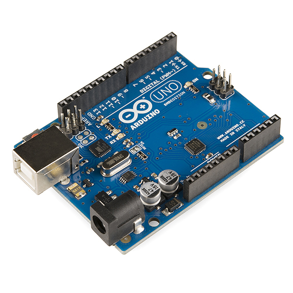
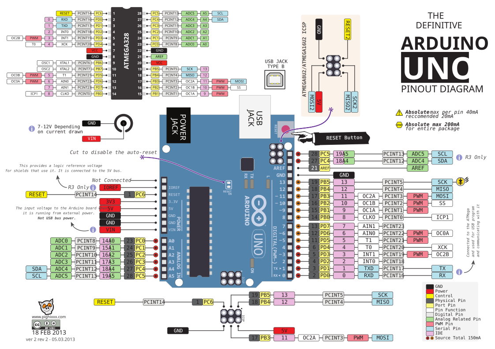

# Modul 01: Pengenalan Arduino, Sejarah & Anatomi Hardware Uno R3

Modul ini membahas latar belakang lahirnya platform Arduino, perbedaan varian board yang umum beredar, dan pembedahan fungsi setiap komponen pada board Arduino Uno R3.

---

## 1. Sejarah Singkat dan Filosofi Open Source

Sebelum Arduino populer di pertengahan dekade 2000-an, belajar mikrokontroler menuntut biaya dan alat yang tidak murah. Platform saat itu seperti BASIC Stamp dihargai berkisar antara $50 hingga $100 per unit, belum termasuk perangkat flash khusus dan compiler berbayar.

Pada tahun 2005 di **Interaction Design Institute Ivrea (IDII)**, Italia, lima pengajar dan insinyur—Massimo Banzi, David Cuartielles, Tom Igoe, Gianluca Martino, dan David Mellis—merancang papan sirkuit alternatif untuk mahasiswa desain. Tujuannya sederhana: sebuah modul mikrokontroler siap pakai yang murah, dapat diprogram lewat kabel USB biasa, dan berjalan di perangkat lunak gratis.

Nama **Arduino** diambil dari sebuah bar di Ivrea (*Bar di Re Arduino*), yang dinamai dari Raja Arduin dari Ivrea pada abad ke-11.

Proyek ini berkembang cepat karena dua lisensi terbuka yang digunakan:
1. **Perangkat Keras Terbuka (Open Source Hardware)**: Skematik dan file CAD PCB dirilis di bawah lisensi *Creative Commons Attribution Share-Alike (CC-BY-SA)*. Siapa pun boleh memproduksi ulang papan tersebut.
2. **Perangkat Lunak Terbuka**: Lingkungan pengembangan (IDE) dan pustaka intinya didistribusikan di bawah lisensi *GPL/LGPL*.

Karena skematiknya bebas diproduksi, banyak pabrikan membuat versi board tiruan (*clone*) dengan harga jauh lebih murah. Selama tidak memalsukan logo resmi Arduino, perakitan dan penjualan board kompatibel ini sepenuhnya legal.

---

## 2. Perbandingan Board Arduino Populer

Arduino Uno R3 adalah varian paling umum untuk belajar, tetapi ekosistem Arduino memiliki beberapa tipe board lain dengan karakteristik berbeda:

| Parameter | Uno R3 | Nano | Mega 2560 | Leonardo |
|---|---|---|---|---|
| **Chip MCU** | ATmega328P | ATmega328P | ATmega2560 | ATmega32U4 |
| **Arsitektur CPU** | 8-bit AVR | 8-bit AVR | 8-bit AVR | 8-bit AVR |
| **Clock Speed** | 16 MHz | 16 MHz | 16 MHz | 16 MHz |
| **Tegangan Kerja** | 5V | 5V | 5V | 5V |
| **Flash Memory** | 32 KB (0.5KB bootloader) | 32 KB | 256 KB (8KB bootloader) | 32 KB (4KB bootloader) |
| **SRAM** | 2 KB | 2 KB | 8 KB | 2.5 KB |
| **EEPROM** | 1 KB | 1 KB | 4 KB | 1 KB |
| **Pin Digital I/O** | 14 (6 pin PWM) | 14 (6 pin PWM) | 54 (15 pin PWM) | 20 (7 pin PWM) |
| **Pin Analog Input** | 6 (ADC 10-bit) | 8 (ADC 10-bit) | 16 (ADC 10-bit) | 12 (ADC 10-bit) |
| **Hardware UART** | 1 port | 1 port | 4 port | 1 port |
| **Chip USB-Serial** | ATmega16U2 / CH340 | CH340 / FT232 | ATmega16U2 / CH340 | Terintegrasi di MCU |
| **Emulasi Keyboard/Mouse** | Tidak | Tidak | Tidak | Ya (Native HID) |

### Kapan Memilih Board Tertentu?
* **Uno R3**: Pilihan terbaik untuk belajar karena ukuran header yang mudah dipasangi kabel jumper dan chip ATmega328P versi DIP mudah diganti jika rusak.
* **Nano**: Fungsi sama persis dengan Uno, tetapi ukurannya kecil dan bisa langsung ditancapkan ke breadboard.
* **Mega 2560**: Dipilih jika proyek membutuhkan puluhan pin sensor atau berkomunikasi dengan beberapa modul serial sekaligus (misal modul GPS, Bluetooth, dan GSM).
* **Leonardo**: Dipilih jika mikrokontroler perlu dikenali komputer sebagai keyboard, mouse, atau gamepad USB langsung tanpa software tambahan.

---

## 3. Anatomi Fisik Arduino Uno R3



Berikut posisi komponen utama pada papan Arduino Uno R3:

```text
               [Konektor USB Tipe B]  [Jack Adaptor DC (7-12V)]
                         |                     |
               +---------+---------------------+---------+
               | [Fuse]   [16U2 / CH340]        [Regulator]
               |                                         |
               |  [Reset]        AREF GND 13-8 (Pin Atas)|
               |                 +-------------+         |
               |                 | O O O O O O |         |
               |                 +-------------+         |
               |                                         |
               |     +-------------------------+         |
               |     |      ATMEGA328P-PU      |         | <-- Mikrokontroler
               |     |    (Socket 28-pin DIP)  |         |     Utama
               |     +-------------------------+         |
               |   [Kristal 16MHz]                       |
               |                 +-------------+         |
               |                 | O O O O O O |         |
               |  POWER HEADER   +-------------+         |
               |  (3.3V, 5V, GND)   ANALOG IN A0-A5      |
               +-----------------------------------------+
```

### 3.1 Mikrokontroler ATmega328P
Chip di tengah papan adalah mikrokontroler 8-bit buatan Atmel (sekarang Microchip Technology). Chip ini memiliki 3 jenis memori internal:
* **Flash Memory (32 KB)**: Tempat kode program hasil kompilasi disimpan. Data tidak hilang saat daya dimatikan. Sekitar 0.5 KB dialokasikan untuk program bootloader.
* **SRAM (Static RAM, 2 KB)**: Tempat variabel program berjalan. Data hilang begitu listrik padam.
* **EEPROM (1 KB)**: Memori penyimpanan kecil yang bisa dibaca dan ditulis lewat program untuk menyimpan konfigurasi permanen (seperti kata sandi atau kalibrasi sensor).

### 3.2 Sistem Catu Daya
Arduino Uno memiliki beberapa jalur suplai listrik:
* **Port USB (5V)**: Mendapat daya langsung dari port USB komputer atau kepala charger. Terdapat sekering otomatis (*polyfuse 500mA*) yang memutus arus jika rangkaian di breadboard mengalami korsleting.
* **DC Barrel Jack (7V - 12V)**: Input untuk baterai atau adaptor AC-DC luar dengan pin tengah bertanda positif.
* **Regulator Tegangan 5V (AMS1117 atau sejenisnya)**: Menurunkan tegangan dari barrel jack menjadi 5V stabil. Kelebihan voltase diubah menjadi panas pada komponen ini.
* **Regulator 3.3V (LP2985)**: Menyuplai tegangan 3.3V dengan kapasitas arus maksimal $150\text{mA}$ untuk modul eksternal berdaya rendah.

> Jangan memasukkan tegangan melebihi 5V langsung ke pin bertanda **5V** pada header, karena jalur ini tidak melewati IC regulator dan bisa merusak ATmega328P.

### 3.3 Komunikasi USB ke Serial
ATmega328P hanya memiliki komunikasi serial UART (pin TX dan RX) dan tidak bisa membaca protokol USB secara langsung. Papan Uno membutuhkan konverter:
* **Papan Original**: Menggunakan chip mikrokontroler kedua, **ATmega16U2**, yang diprogram sebagai USB-to-UART bridge.
* **Papan Clone**: Umumnya menggunakan chip dedicated seperti **CH340** atau **FT232RL**. Chip ini berfungsi normal, namun di beberapa komputer Windows/macOS lawas membutuhkan instalasi driver manual.

### 3.4 Mekanisme Auto-Reset (Sinyal DTR)
Pada sistem lama, pengguna harus menekan tombol reset pada board tepat saat komputer hendak mengirim kode baru.
Arduino Uno menghubungkan pin DTR (*Data Terminal Ready*) dari chip USB-to-Serial ke pin RESET ATmega328P melalui kapasitor $100\text{nF}$. Setiap kali perangkat lunak di komputer membuka koneksi serial untuk upload, sinyal DTR turun sesaat dan mereset mikrokontroler secara otomatis agar bootloader siap menerima file program.

### 3.5 Kristal Osilator 16 MHz
Komponen tabung perak lonjong di samping mikrokontroler adalah kristal kuarsa yang menghasilkan detak clock 16 MHz. Setiap siklus instruksi dieksekusi dalam durasi:

$$t = \frac{1}{16.000.000\text{ Hz}} = 62.5\text{ nanodetik}$$

Sebagian besar instruksi assembler pada arsitektur AVR membutuhkan 1 sampai 2 siklus detak.

---

## 4. Fungsi Pin Header Arduino Uno R3



Papan Uno memiliki total 32 lubang pin header yang terbagi menjadi kelompok berikut:

```
                          PINOUT ARDUINO UNO R3
                         +--------------------+
                  [NC] --|                    |-- [VIN] (Tegangan Masuk 7-12V)
               [IOREF] --|                    |-- [GND] Ground
               [RESET] --|                    |-- [GND] Ground
                [3.3V] --|                    |-- [5V] Output Tegangan 5V
                  [5V] --|                    |-- [3.3V] Output Tegangan 3.3V
                 [GND] --|                    |-- [RESET] Jalur Reset
                 [GND] --|                    |-- [IOREF]
                 [VIN] --|                    |-- [NC]
                         |                    |
       Analog In A0/D14 --|                    |-- Pin D0 (RX / Data Masuk Serial)
       Analog In A1/D15 --|                    |-- Pin D1 (TX / Data Keluar Serial)
       Analog In A2/D16 --|                    |-- Pin D2 (External Interrupt 0)
       Analog In A3/D17 --|                    |-- Pin D3 (PWM / Ext. Interrupt 1)
   (SDA) Analog In A4/D18 --|                    |-- Pin D4
   (SCL) Analog In A5/D19 --|                    |-- Pin D5 (PWM)
                         |                    |-- Pin D6 (PWM)
                         |                    |-- Pin D7
                         |                    |
                         |                    |-- Pin D8
                         |                    |-- Pin D9 (PWM)
                         |                    |-- Pin D10 (PWM / SPI SS)
                         |                    |-- Pin D11 (PWM / SPI MOSI)
                         |                    |-- Pin D12 (SPI MISO)
                         |                    |-- Pin D13 (Built-in LED / SPI SCK)
                         |                    |-- [GND] Ground
                         |                    |-- [AREF] Referensi Tegangan ADC
                         |                    |-- [SDA] Jalur Data I2C
                         |                    |-- [SCL] Jalur Clock I2C
                         +--------------------+
```

### Pin Digital (D0 – D13)
Pin ini bisa membaca logika HIGH (5V) dan LOW (0V) saat diatur sebagai input, atau mengeluarkan tegangan 5V saat diatur sebagai output. Beberapa pin memiliki fungsi periferal:
* **D0 (RX) & D1 (TX)**: Digunakan untuk jalur komunikasi serial dengan komputer. Jangan menghubungkan sensor atau sakelar ke dua pin ini jika program menggunakan `Serial.begin()`.
* **D2 & D3**: Pin interupsi eksternal perangkat keras (Hardware Interrupt). Berguna untuk mendeteksi kejadian mendadak seperti tombol stop darurat.
* **D3, D5, D6, D9, D10, D11 (Tanda `~`)**: Mendukung sinyal PWM (Pulse Width Modulation) 8-bit untuk mengatur kecerahan LED atau kecepatan motor.
* **D10 (SS), D11 (MOSI), D12 (MISO), D13 (SCK)**: Jalur komunikasi SPI berkecepatan tinggi.
* **D13**: Terhubung ke lampu LED kecil berwarna kuning/oranye di atas papan (diberi label **L**).

### Pin Analog (A0 – A5)
* Terhubung ke konverter analog ke digital (ADC) internal 10-bit yang memetakan tegangan $0 - 5\text{V}$ ke angka $0 - 1023$.
* Dapat difungsikan sebagai pin digital biasa (dengan nomor pin D14 sampai D19).
* **Pin A4 dan A5**: Berfungsi ganda sebagai pin jalur komunikasi I2C (A4 = SDA, A5 = SCL), yang akan kita gunakan untuk menyambungkan modul LCD 1602.

### Batasan Arus Listrik Pin (Penting)
Mikrokontroler ATmega328P memiliki batasan fisik kemampuan menyuplai arus:
* **Batas aman per pin GPIO**: Maksimal $20\text{mA}$ (batas absolut $40\text{mA}$). Menghubungkan beban yang menarik arus lebih dari ini (misal motor DC langsung atau buzzer tanpa resistor) dapat merusak jalur output chip.
* **Batas total seluruh pin**: Total arus keluar dari seluruh pin GPIO yang aktif bersamaan tidak boleh melebihi $200\text{mA}$.

---

## 5. Ringkasan

1. Arduino menyederhanakan akses mikrokontroler dengan menyediakan rangkaian standar siap pakai, software gratis, dan skematik terbuka.
2. Arduino Uno R3 ditenagai chip ATmega328P dengan kecepatan 16 MHz, memori Flash 32 KB, dan SRAM 2 KB.
3. Sambungan USB ke komputer menggunakan chip perantara (ATmega16U2 pada board resmi, CH340 pada board tiruan).
4. Pin I/O digital hanya mampu mengeluarkan arus aman hingga $20\text{mA}$. Beban lebih besar wajib digerakkan lewat transistor atau modul relay.

---

Pada modul berikutnya, **[Modul 02: Kupas Tuntas Arduino IDE 2.x, Toolchain & Driver](../02_arduino_ide_toolchain/README.md)**, kita akan menyiapkan aplikasi Arduino IDE 2.x, memastikan komputer mengenali port serial board, dan mengupas cara kerja proses kompilasi hingga pengunggahan kode ke board.
