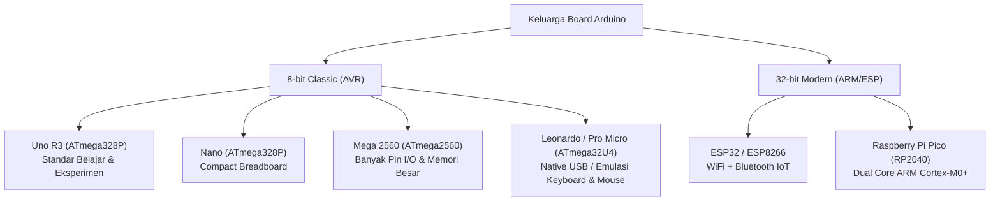

# Modul 01: Pengenalan Arduino, Sejarah & Anatomi Hardware Uno R3

Selamat datang di modul pembuka seri tutorial Arduino! Di modul ini, kita akan membongkar fondasi paling mendasar: dari mana platform ini berasal, mengapa Arduino merevolusi dunia teknologi, perbedaan berbagai varian board, hingga pembedahan anatomis setiap komponen sirkuit yang tertanam pada papan **Arduino Uno R3**.

---

## 1. Sejarah & Filosofi: Lahirnya Revolusi Open-Source

### 1.1 Latar Belakang & Masalah Masa Lalu
Pada awal dekade 2000-an, mempelajari mikrokontroler adalah hal yang mahal dan rumit. Mahasiswa dan perancang interaktif yang ingin membuat purwarupa perangkat keras harus menggunakan platform seperti *BASIC Stamp* (yang harganya saat itu mencapai $50–$100 per keping) atau chip PIC/AVR *bare metal* yang memerlukan:
1. Perangkat keras *programmer* khusus (dongle paralel/serial mahal).
2. Perangkat lunak kompilator komersial berlisensi.
3. Pengetahuan mendalam tentang manipulasi register biner mikrokontroler dan assembler/C tingkat rendah.

Pada tahun 2003–2005 di **Interaction Design Institute Ivrea (IDII)** di Ivrea, Italia, sebuah tim pendidik dan insinyur berkumpul untuk menciptakan solusi alternatif yang murah, ramah desainer, dan mudah dipelajari. Tim tersebut terdiri dari:
* **Massimo Banzi**
* **David Cuartielles**
* **Tom Igoe**
* **Gianluca Martino**
* **David Mellis** (mengembangkan software berbasis framework *Wiring* karya Hernando Barragán)

### 1.2 Asal Nama "Arduino"
Nama **Arduino** diambil dari sebuah bar lokal di Ivrea (*Bar di Re Arduino*), tempat Massimo Banzi dan rekan-rekannya sering berkumpul untuk berdiskusi. Bar tersebut sendiri dinamai untuk menghormati **Raja Arduin dari Italia**, penguasa wilayah Ivrea pada tahun 1002 Masehi.

### 1.3 Filosofi Open Source Hardware (OSHW)
Keberhasilan masif Arduino didorong oleh keputusan revolusioner tim pembuatnya untuk membuka seluruh desain secara bebas (*open source*):
* **Skematik & Desain PCB**: Dirilis di bawah lisensi *Creative Commons Attribution Share-Alike (CC-BY-SA)*. Siapa pun di dunia diizinkan mengunduh, mempelajari, memodifikasi, dan memproduksi board tersebut sendiri.
* **Software (IDE & Core Libraries)**: Dirilis di bawah lisensi *GNU General Public License (GPL)* dan *Lesser GPL (LGPL)*.

> [!NOTE]
> Karena desain perangkat kerasnya berstatus *Open Source*, siapa saja sah secara hukum memproduksi clone papan Arduino (seperti board berlogo Geekcreit, Robotdyn, dll.), asalkan **tidak mencantumkan logo resmi atau merek dagang terdaftar "Arduino"** tanpa izin.

---

## 2. Mengenal Ragam Board Arduino

Meskipun fokus utama kita adalah **Arduino Uno R3**, sangat penting untuk memahami posisi board ini di antara varian Arduino lainnya:



### Tabel Komparasi Teknis Board Populer

| Parameter | Arduino Uno R3 | Arduino Nano | Arduino Mega 2560 | Arduino Leonardo |
|---|---|---|---|---|
| **Mikrokontroler** | ATmega328P | ATmega328P | ATmega2560 | ATmega32U4 |
| **Arsitektur CPU** | AVR 8-bit | AVR 8-bit | AVR 8-bit | AVR 8-bit |
| **Kecepatan Clock** | 16 MHz | 16 MHz | 16 MHz | 16 MHz |
| **Tegangan Operasi** | 5 Volt | 5 Volt | 5 Volt | 5 Volt |
| **Flash Memory** | 32 KB (0.5KB bootloader) | 32 KB | 256 KB (8KB bootloader) | 32 KB (4KB bootloader) |
| **SRAM** | 2 KB | 2 KB | 8 KB | 2.5 KB |
| **EEPROM** | 1 KB | 1 KB | 4 KB | 1 KB |
| **Pin Digital I/O** | 14 (6 pin PWM) | 14 (6 pin PWM) | 54 (15 pin PWM) | 20 (7 pin PWM) |
| **Pin Analog Input** | 6 (ADC 10-bit) | 8 (ADC 10-bit) | 16 (ADC 10-bit) | 12 (ADC 10-bit) |
| **Hardware UART** | 1 port | 1 port | **4 port** | 1 port (Serial1) |
| **Antarmuka USB** | ATmega16U2 / CH340 | CH340 / FT232RL | ATmega16U2 / CH340 | **Native USB terintegrasi** |
| **Native USB HID** | ❌ Tidak bisa | ❌ Tidak bisa | ❌ Tidak bisa | ✔️ Bisa (Keyboard/Mouse) |

---

## 3. Pembedahan Anatomi Hardware Arduino Uno R3

Mari kita bedah papan Arduino Uno R3 bagian per bagian. Diagram tata letak komponen berikut merepresentasikan posisi fisik komponen pada board Uno R3 standar:

```text
               [USB Port Tipe B]      [DC Barrel Jack (7-12V)]
                     |                         |
               +-----+-------------------------+-----+
               | [16U2 / CH340]        [Regulator 5V]|
               |                                     |
               |  [Reset Btn]     AREF GND 13-8      | <-- Header Digital Atas
               |                 +-------------+     |
               |                 | O O O O O O |     |
               |                 +-------------+     |
               |                                     |
               |     +-------------------------+     |
               |     |      ATMEGA328P-PU      |     | <-- Chip MCU Utama
               |     |     (DIP-28 Socket)     |     |     (Otak Arduino)
               |     +-------------------------+     |
               |   [Kristal 16MHz]                   |
               |                 +-------------+     |
               |                 | O O O O O O |     |
               |  POWER HEADER   +-------------+     |
               |  (3.3V, 5V, GND)   ANALOG IN A0-A5  | <-- Header Bawah
               +-------------------------------------+
```

### 3.1 Otak Utama: Mikrokontroler ATmega328P
Chip panjang berlubang (DIP-28) atau kotak kecil (SMD TQFP-32) di tengah papan adalah mikrokontroler CMOS 8-bit berdaya rendah berbasis arsitektur Harvard AVR:
* **Program Flash Memory (32 KB)**: Tempat firmware atau program kompilasi biner (`.hex`) Anda disimpan secara permanen. Nilai tidak hilang saat papan dimatikan.
* **SRAM (Static RAM - 2 KB)**: Tempat semua variabel kerja, pemanggilan fungsi *stack*, dan alokasi data sementara runtime disimpan. Data hilang saat papan kehilangan daya (*volatile*).
* **EEPROM (1 KB)**: Memori non-volatile internal untuk menyimpan konfigurasi atau pengaturan pengguna yang tetap bertahan saat listrik padam.

### 3.2 Subsistem Catu Daya (Power Management)
Papan Uno memiliki sistem daya fleksibel dengan beberapa jalur input:
1. **Konektor USB Tipe-B (5V)**: Menerima daya langsung dari port USB komputer atau adaptor 5V USB. Dilengkapi sekering otomatis (*Polyfuse 500mA*) yang akan memutus arus sementara jika terjadi korsleting, melindungi port USB komputer Anda.
2. **DC Barrel Jack (7V - 12V DC)**: Menerima input adaptor dinding atau baterai 9V (center-positive, pin tengah positif).
3. **IC Voltage Regulator (AMS1117 / LP2985 - 5V)**: Menurunkan tegangan DC dari barrel jack (misal 9V atau 12V) menjadi 5V stabil untuk mikrokontroler. Sisa tegangan dibuang menjadi panas.
4. **Regulator 3.3V (LP2985)**: Menghasilkan tegangan 3.3V dengan kapasitas arus hingga $150\text{mA}$ untuk modul eksternal bertegangan rendah.
5. **Pin VIN**: Pin header yang terhubung langsung sebelum regulator 5V. Dapat digunakan untuk memberi makan daya 7–12V dari baterai eksternal atau membaca tegangan dari DC Jack.

> [!CAUTION]
> Jangan pernah menghubungkan tegangan lebih dari 5.5V langsung ke pin **5V** Arduino, karena pin ini membypass regulator. Kesalahan polaritas atau tegangan berlebih di pin 5V akan langsung membakar chip ATmega328P!

### 3.3 Chip Komunikasi USB-to-UART Bridge
Mikrokontroler ATmega328P tidak memiliki antarmuka USB langsung; ia hanya memahami komunikasi serial TTL (UART via pin TX/RX). Oleh karena itu, diperlukan chip penerjemah:
* **Pada Board Original / R3 Asli**: Menggunakan mikrokontroler kedua, yaitu **ATmega16U2** (sebelumnya ATmega8U2). Chip ini dapat diprogram ulang firmware-nya (misal menjadi MIDI controller atau HID via HoodLoader2).
* **Pada Board Clone (Ekonomis)**: Menggunakan chip antarmuka USB-ke-Serial khusus seperti **CH340G / CH340C** buatan WCH, atau **FT232RL** buatan FTDI. Chip ini bekerja sangat stabil namun memerlukan driver khusus di beberapa sistem operasi.

### 3.4 Jalur Auto-Reset DTR
Pada zaman mikrokontroler klasik, saat mengunggah program baru, kita harus menekan tombol reset manual tepat sebelum software komputer mulai mengirim byte.
Pada Arduino Uno R3, jalur sinyal **DTR (Data Terminal Ready)** dari chip USB-to-UART dihubungkan ke pin **RESET** ATmega328P melalui kapasitor decoupling $100\text{nF}$. Saat software pengunggah (`avrdude`) membuka port serial pada 115200 baud, DTR ditarik ke `LOW`, memicu auto-reset pada mikrokontroler sehingga bootloader langsung aktif menerima kode baru secara otomatis.

### 3.5 Kristal Osilator 16 MHz
Komponen berbentuk lempeng logam lonjong perak di samping ATmega328P adalah kristal osilator kuarsa 16.000 MHz. Osilator ini berfungsi sebagai detak jantung (*heartbeat*) mikrokontroler. Pada 16 MHz, mikrokontroler mengeksekusi 1 siklus instruksi dasar dalam:

$$t_{\text{siklus}} = \frac{1}{16.000.000\text{ Hz}} = 62.5\text{ nanodetik}$$

Mayoritas instruksi arsitektur AVR adalah *single-cycle*, artinya ATmega328P mampu mengeksekusi mendekati 16 MIPS (Million Instructions Per Second).

---

## 4. Pemetaan Lengkap Pinout Header Arduino Uno R3

Header pinout Uno R3 terbagi menjadi empat kelompok fungsional utama:

```
                          ARDUINO UNO R3 PINOUT
                         +--------------------+
                  [NC] --|                    |-- [VIN] (Input 7-12V)
               [IOREF] --|                    |-- [GND] Ground
               [RESET] --|                    |-- [GND] Ground
                [3.3V] --|                    |-- [5V] Output 5V
                  [5V] --|                    |-- [3.3V] Output 3.3V
                 [GND] --|                    |-- [RESET]
                 [GND] --|                    |-- [IOREF]
                 [VIN] --|                    |-- [NC]
                         |                    |
       Analog In A0/D14 --|                    |-- Pin D0 (RX / Serial Receive)
       Analog In A1/D15 --|                    |-- Pin D1 (TX / Serial Transmit)
       Analog In A2/D16 --|                    |-- Pin D2 (External Interrupt 0)
       Analog In A3/D17 --|                    |-- Pin D3 (PWM / Ext. Interrupt 1)
   (SDA) Analog In A4/D18 --|                    |-- Pin D4
   (SCL) Analog In A5/D19 --|                    |-- Pin D5 (PWM)
                         |                    |-- Pin D6 (PWM)
                         |                    |-- Pin D7
                         |                    |
                         |                    |-- Pin D8
                         |                    |-- Pin D9 (PWM)
                         |                    |-- Pin D10 (PWM / SPI SS)
                         |                    |-- Pin D11 (PWM / SPI MOSI)
                         |                    |-- Pin D12 (SPI MISO)
                         |                    |-- Pin D13 (Built-in LED / SPI SCK)
                         |                    |-- [GND] Ground
                         |                    |-- [AREF] Analog Reference
                         |                    |-- [SDA] Duplikat I2C SDA
                         |                    |-- [SCL] Duplikat I2C SCL
                         +--------------------+
```

### 4.1 Digital Pin (D0 – D13)
Dapat dikonfigurasi sebagai Input digital (membaca logika HIGH/LOW) atau Output digital (mengeluarkan tegangan 5V/0V). Beberapa pin memiliki fungsi periferal khusus:
* **D0 (RX) & D1 (TX)**: Jalur komunikasi serial Hardware UART. Terhubung ke chip USB-to-UART dan LED indikator onboard TX/RX.
  > [!WARNING]
  > Hindari menghubungkan sakelar atau sensor ke pin D0 dan D1 jika Anda menggunakan fitur `Serial`, karena akan mengganggu proses pengunggahan (*upload*) program dan komunikasi data serial.
* **D2 & D3**: Pin interupsi perangkat keras eksternal (**INT0** pada D2, **INT1** pada D3).
* **D3, D5, D6, D9, D10, D11 (Pin Bertanda `~`)**: Mendukung **PWM (Pulse Width Modulation)** perangkat keras 8-bit untuk kontrol intensitas analog semu.
* **D10 (SS), D11 (MOSI), D12 (MISO), D13 (SCK)**: Jalur bus komunikasi **SPI (Serial Peripheral Interface)** berkecepatan tinggi.
* **D13**: Terhubung langsung ke LED indikator onboard berwarna oranye/kuning berlabel **L** melalui rangkaian op-amp penyangga (*buffer*).

### 4.2 Analog Pin (A0 – A5)
* Terhubung ke modul **ADC (Analog-to-Digital Converter)** 10-bit internal. Mengubah rentang tegangan $0 - 5\text{V}$ menjadi nilai integer desimal $0 - 1023$.
* **Dapat berfungsi sebagai pin Digital I/O**: Pin A0 hingga A5 dapat difungsikan sebagai pin digital standar dengan alias pin D14 sampai D19 (`pinMode(A0, OUTPUT); digitalWrite(A0, HIGH);`).
* **Fungsi Bus I2C**:
  * **Pin A4**: Berfungsi sebagai jalur **SDA** (Serial Data).
  * **Pin A5**: Berfungsi sebagai jalur **SCL** (Serial Clock).

### 4.3 ICSP Header (In-Circuit Serial Programming)
Konektor pin 2x3 yang menonjol di dekat chip ATmega328P adalah port ICSP standar:
* Pinout: 1=MISO, 2=VCC, 3=SCK, 4=MOSI, 5=RESET, 6=GND.
* Berfungsi untuk melakukan flashing bootloader atau firmware secara langsung menggunakan programmer eksternal (seperti USBasp, USBtinyISP, atau Arduino lain yang difungsikan sebagai ISP) tanpa melalui chip USB-to-UART.

---

## 5. Rangkuman & Kuis Pemahaman Mandiri

### Intisari Modul 01:
1. **Arduino** lahir di Ivrea (Italia) sebagai proyek *Open Source Hardware & Software* untuk mendemokratisasi akses ke teknologi mikrokontroler.
2. **Uno R3** menggunakan mikrokontroler **ATmega328P** berkecepatan **16 MHz**, dengan kapasitas memori **32 KB Flash**, **2 KB SRAM**, dan **1 KB EEPROM**.
3. Komunikasi PC-ke-Arduino dijembatani oleh chip USB-to-UART (ATmega16U2 pada versi original, CH340 pada versi clone).
4. Auto-reset dipicu oleh pulsa kapasitif jalur **DTR**, menghilangkan kebutuhan menekan tombol reset secara manual saat flashing.
5. Arus aman maksimum per pin I/O adalah $\le 20\text{mA}$ (batas mutlak $40\text{mA}$), dan total arus seluruh package mikrokontroler tidak boleh melebihi $200\text{mA}$.

### 📝 Kuis Uji Pemahaman:
1. *Berapa ukuran kapasitas memori SRAM pada Arduino Uno R3, dan apa yang terjadi jika kode program mengalokasikan data dinamis melebihi kapasitas tersebut?*
2. *Mengapa saat memprogram proyek yang memanfaatkan fitur `Serial.begin()`, kita sebaiknya tidak memasang tombol atau relay pada pin Digital 0 (RX) dan Digital 1 (TX)?*
3. *Jika kita ingin menyalakan komponen yang membutuhkan tegangan 5V dengan kebutuhan arus $120\text{mA}$, bolehkah komponen tersebut dihubungkan langsung ke pin GPIO Arduino (misal pin D8)? Mengapa?*

---

Di modul berikutnya (**[Modul 02: Kupas Tuntas Arduino IDE 2.x, Toolchain & Driver](../02_arduino_ide_toolchain/README.md)**), kita akan menginstal dan membedah antarmuka lingkungan kerja Arduino IDE 2.x, konfigurasi driver Linux/Windows, Boards & Library Manager, serta memahami apa yang sebenarnya terjadi di balik layar saat Anda menekan tombol *Compile* dan *Upload*.
