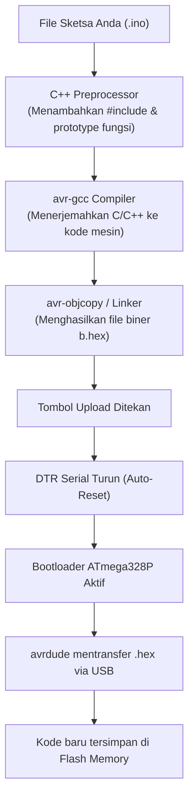

# Modul 02: Kupas Tuntas Arduino IDE 2.x, Toolchain & Driver

Modul ini memandu instalasi dan konfigurasi Arduino IDE versi 2.x, penyelesaian masalah izin port serial di Linux dan Windows, navigasi fitur editor modern, serta membedah alur kerja toolchain di balik tombol kompilasi dan upload.

---

## 1. Menyiapkan Lingkungan Kerja

Arduino IDE 2.x adalah perombakan besar dari versi warisan 1.8.x. Versi ini dibangun di atas basis Eclipse Theia (arsitektur serupa VS Code), membawa fitur penting seperti *autocompletion* kode, navigasi fungsi, dan antarmuka Serial Monitor yang terintegrasi di jendela utama.

### 1.1 Unduh dan Pasang IDE
1. Buka laman resmi [arduino.cc/en/software](https://www.arduino.cc/en/software).
2. Unduh paket sesuai sistem operasi:
   * **Linux**: Format AppImage (bisa langsung dijalankan tanpa instalasi sistem) atau arsip `.tar.gz`.
   * **Windows**: Installer `.exe` (Windows 10/11 64-bit).
   * **macOS**: File `.dmg` (tersedia untuk arsitektur Intel maupun Apple Silicon).

Untuk pengguna Linux, berikan izin eksekusi pada file AppImage yang baru diunduh:
```bash
chmod +x arduino-ide_*_Linux_64bit.AppImage
./arduino-ide_*_Linux_64bit.AppImage
```

---

## 2. Masalah Port Serial & Driver USB

Salah satu kendala paling sering dialami pemula adalah board tidak terdeteksi di menu port atau muncul pesan kesalahan:
`avrdude: ser_open(): can't open device "/dev/ttyUSB0": Permission denied`

### 2.1 Konfigurasi Izin Port di Linux
Di sistem berbasis Linux (Ubuntu, Debian, Fedora, Arch), port serial hardware dibatasi hak aksesnya ke grup sistem tertentu (biasanya grup `dialout` atau `uucp`).

Jalankan perintah ini di terminal untuk menambahkan pengguna Anda ke grup tersebut:
```bash
# Untuk keluarga Ubuntu / Debian:
sudo usermod -a -G dialout $USER

# Untuk keluarga Arch Linux / Fedora:
sudo usermod -a -G uucp $USER
```
Setelah menjalankan perintah di atas, **keluar (logout) lalu masuk kembali** ke sesi desktop Anda agar perubahan grup diterapkan.

Untuk memeriksa apakah papan Uno R3 sudah dikenali kernel Linux saat kabel USB ditancapkan:
```bash
lsusb
dmesg | tail -n 20
```
Jika board menggunakan chip resmi, output akan menampilkan `Arduino SA Uno R3 (CDC ACM)`. Jika menggunakan chip clone, output akan menampilkan `QinHeng Electronics CH340 serial converter`.

### 2.2 Driver CH340 untuk Windows
Jika menggunakan Arduino Uno clone dengan chip USB CH340 di Windows:
1. Pasang kabel USB ke komputer. Buka **Device Manager**.
2. Jika di bawah kategori *Ports (COM & LPT)* muncul perangkat bertanda seru kuning bernama `USB2.0-Serial`, Anda perlu mengunduh driver CH341SER dari situs resmi pembuatnya (WCH) lalu jalankan `SETUP.EXE`.
3. Setelah terpasang, port akan terbaca normal, misalnya `USB-SERIAL CH340 (COM3)`.

---

## 3. Navigasi Antarmuka Arduino IDE 2.x

Jendela utama Arduino IDE 2.x memiliki bilah navigasi vertikal di sisi kiri:

```text
+---+--------------------------------------------------------------+
|   |  [Select Board & Port v]   [ > Verify ]   [ >> Upload ]      |
| F |--------------------------------------------------------------|
| I | sketch_sep18a.ino                                            |
| L | 1  void setup() {                                            |
| E | 2    // Inisialisasi dijalankan sekali                       |
|   | 3    pinMode(LED_BUILTIN, OUTPUT);                           |
| B | 4  }                                                         |
| O | 5                                                            |
| A | 6  void loop() {                                             |
| R | 7    digitalWrite(LED_BUILTIN, HIGH);                        |
| D | 8    delay(1000);                                            |
|   | 9    digitalWrite(LED_BUILTIN, LOW);                         |
| L | 10   delay(1000);                                            |
| I | 11 }                                                         |
| B |--------------------------------------------------------------|
|   | Output / Serial Monitor                                      |
| D | Sketch uses 924 bytes (2%) of program storage space.         |
| E | Global variables use 9 bytes (0%) of dynamic memory.         |
+---+--------------------------------------------------------------+
```

### 3.1 Navigasi Panel Kiri
1. **Sketchbook**: Daftar file proyek Arduino lokal di folder kerja Anda.
2. **Boards Manager**: Mengunduh dan memperbarui paket mikrokontroler (Board Cores). Papan Uno R3 memakai paket bawaan `Arduino AVR Boards`. Jika suatu saat Anda memprogram ESP32 atau Raspberry Pi Pico, paketnya diinstal lewat menu ini.
3. **Library Manager**: Tempat mengunduh kode pustaka siap pakai buatan komunitas (misalnya library LCD I2C).
4. **Debug**: Fitur penelusuran breakpoint untuk board yang memiliki interface JTAG/SWD (Uno R3 tidak mendukung fitur debug in-circuit ini karena keterbatasan hardware AVR standar).
5. **Search**: Mencari teks di seluruh file dalam sketsa.

### 3.2 Pemilihan Board dan Port
Pada bilah atas, terdapat menu drop-down:
1. Klik kotak drop-down di sebelah tombol Upload.
2. Pilih board: **Arduino Uno**.
3. Pilih port yang sesuai:
   * Linux: `/dev/ttyACM0` (board original) atau `/dev/ttyUSB0` (board clone CH340).
   * Windows: `COM3`, `COM4`, dst.

---

## 4. Alat Diagnostik Bawaan: Serial Monitor & Serial Plotter

### 4.1 Serial Monitor
Tombol kaca pembesar di pojok kanan atas membuka panel **Serial Monitor** di bagian bawah editor. Panel ini bertindak sebagai terminal teks dua arah antara Arduino dan komputer.

Elemen penting di Serial Monitor:
* **Baud Rate**: Kecepatan transfer data per detik (misal `9600`, `115200`). Angka ini **wajib sama** dengan nilai yang Anda tentukan di baris `Serial.begin(kecepatan)` di dalam program. Jika tidak cocok, output yang muncul akan berupa karakter acak (*garbage text*).
* **Line Ending**: Opsi akhiran baris saat mengirim teks dari komputer (`No line ending`, `Newline \n`, `Carriage return \r`, atau `Both NL & CR`).
* **Timestamp**: Menampilkan penanda waktu komputer pada setiap baris data yang masuk.

### 4.2 Serial Plotter
Dapat dibuka lewat menu **Tools > Serial Plotter** (atau ikon grafik di kanan atas).
Fitur ini otomatis memetakan angka yang dikirim mikrokontroler lewat serial menjadi grafik kurva visual secara real-time. Jika Anda mengirim beberapa nilai angka yang dipisahkan spasi atau koma, Serial Plotter akan menggambar beberapa garis kurva berwarna berbeda sekaligus.

---

## 5. Di Balik Layar: Apa yang Terjadi Saat Compile dan Upload?

Menekan tombol **Verify** (tanda centang) dan **Upload** (tanda panah kanan) sebenarnya menjalankan serangkaian program command-line di sistem Anda:



### Langkah 1: Preprocessing
File `.ino` bukanlah C++ murni. Sebelum dikompilasi, Arduino IDE mengubahnya menjadi file C++ standar:
* Menyisipkan header `#include <Arduino.h>`.
* Membuat deklarasi prototype fungsi otomatis sehingga Anda bisa memanggil fungsi sebelum posisinya ditulis di bagian bawah kode.

### Langkah 2: Kompilasi (`avr-gcc`)
Compiler `avr-gcc` memvalidasi sintaks dan menerjemahkan kode C/C++ menjadi instruksi mesin arsitektur AVR, lalu linker menggabungkan fungsi pustaka bawaan dan menghasilkan file biner heksadesimal bertipe `.hex`.

### Langkah 3: Pengunggahan (`avrdude`)
Arduino IDE memanggil tool bernama **avrdude** (*AVR Downloader/Uploader*).
1. IDE membuka port serial pada 115200 baud, memicu pin DTR turun ke logika LOW sesaat.
2. Kapasitor $100\text{nF}$ menarik pin RESET ATmega328P ke ground, mereset mikrokontroler.
3. Begitu mikrokontroler menyala, program kecil bernama **Bootloader** (yang sudah tersimpan di alamat atas memori flash ATmega328P) aktif selama sekitar 1 detik.
4. Bootloader mendengarkan sinyal komunikasi serial via protokol STK500. `avrdude` mengirim file `.hex` blok per blok dan menuliskannya ke memori Flash.
5. Selesai menulis, bootloader melompat ke alamat memori `0x0000`, dan program Anda mulai berjalan.

---

## 6. Uji Coba: Program Blink Pertama

Mari kita pastikan seluruh instalasi berfungsi normal dengan mengunggah sketsa dasar untuk menyalakan LED built-in pada pin 13.

### 6.1 Kode Program
Buka menu **File > Examples > 01.Basics > Blink**, atau salin kode berikut ke editor:

```cpp
// blink_test.ino
// Mengedipkan LED bawaan pada pin 13 setiap 1 detik

const uint8_t LED_PIN = 13;

void setup() {
  // Atur pin 13 sebagai keluaran digital
  pinMode(LED_PIN, OUTPUT);
}

void loop() {
  digitalWrite(LED_PIN, HIGH); // Nyalakan LED
  delay(1000);                  // Tunggu 1000 milidetik (1 detik)
  digitalWrite(LED_PIN, LOW);  // Padamkan LED
  delay(1000);                  // Tunggu 1 detik
}
```

### 6.2 Langkah Eksekusi
1. Pastikan board **Arduino Uno** dan port serial yang sesuai sudah terpilih di bilah atas.
2. Klik tombol **Upload** (panah ke kanan).
3. Perhatikan lampu kecil bertanda **TX** dan **RX** di papan Uno akan berkedip cepat selama proses transfer berlangsung.
4. Jendela output di bagian bawah akan menampilkan pesan `Done uploading`.
5. Amati lampu LED oranye berlabel **L** di dekat pin 13: lampu tersebut akan menyala selama 1 detik lalu padam 1 detik secara berulang.

---

## 7. Alternatif Modern: Simulasi Wokwi

Jika Anda sedang tidak membawa board fisik atau ingin memverifikasi kode tanpa risiko merusak komponen, gunakan simulator web **Wokwi**:
1. Buka [wokwi.com](https://wokwi.com).
2. Pilih template **Arduino Uno**.
3. Anda langsung mendapatkan editor kode dan kanvas sirkuit virtual lengkap. Anda bisa menambahkan LED, resistor, tombol, modul LCD I2C, hingga relay secara instan di peramban tanpa instalasi apa pun.

---

## 8. Ringkasan

1. Arduino IDE 2.x menyediakan autocompletion, board manager, dan serial plotter terintegrasi.
2. Di Linux, izin port serial diselesaikan dengan memasukkan user ke grup `dialout` atau `uucp`.
3. Kecepatan Baud Rate di Serial Monitor wajib disesuaikan dengan nilai `Serial.begin()` pada program agar output tidak rusak.
4. Proses kompilasi mengubah sketsa `.ino` menjadi binary `.hex` via `avr-gcc`, lalu diunggah oleh `avrdude` ke memori Flash mikrokontroler memanfaatkan auto-reset pin DTR.

---

Di modul berikutnya, **[Modul 03: Dasar Elektronika untuk Mikrokontroler](../03_dasar_elektronika/README.md)**, kita akan membahas teori listrik dasar yang wajib dipahami sebelum menghubungkan komponen: Hukum Ohm, cara menghitung hambatan resistor untuk LED, dan batas aman arus pin agar mikrokontroler tidak terbakar.
