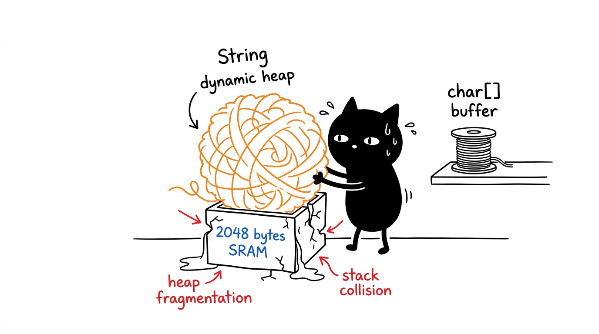

# Modul 04: Fondasi Pemrograman Embedded C/C++ pada Arduino

Bahasa pemrograman Arduino pada dasarnya adalah C++ standar dengan pustaka abstraksi perangkat keras. Namun, memprogram mikrokontroler dengan memori SRAM hanya 2 KB (2.048 byte) sangat berbeda dengan memprogram komputer desktop. 

Modul ini membahas siklus eksekusi program, pemilihan tipe data yang hemat memori, alasan teknis mengapa objek `String` dihindari di mikrokontroler AVR, serta penggunaan macro `F()` untuk menghemat RAM.

---

## 1. Siklus Eksekusi: Apa yang Sebenarnya Terjadi?

Program Arduino standar terdiri dari dua fungsi wajib:

```cpp
void setup() {
  // Dijalankan satu kali saat board pertama kali menyala atau di-reset
}

void loop() {
  // Dijalankan berulang kali tanpa henti selama board menerima daya
}
```

Di balik layar, compiler Arduino menyisipkan file `main.cpp` standar C++ yang menyatukan kedua fungsi tersebut dalam kode berikut:

```cpp
// Implementasi internal main.cpp di core Arduino AVR
int main(void) {
  init();          // Menginisialisasi timer hardware untuk fungsi millis() & PWM
  initVariant();   // Konfigurasi pinout board khusus

  setup();         // Memanggil fungsi setup milik pengguna

  for (;;) {       // Loop tanpa batas (infinite loop)
    loop();        // Memanggil fungsi loop milik pengguna
    if (serialEventRun) serialEventRun();
  }
  return 0;
}
```

Karena berada di dalam `for (;;) { ... }`, fungsi `loop()` akan langsung dipanggil ulang begitu baris terakhirnya selesai dieksekusi.

---

## 2. Memahami Anggaran Memori ATmega328P

Arduino Uno memiliki 3 area memori fisik yang terpisah (arsitektur Harvard):

```text
  +-----------------------+ 32 KB Flash Memory
  | Bootloader (0.5 KB)   | (Tempat kode program biner .hex disimpan.
  | Program Kode Anda     |  Hanya bisa dibaca saat runtime).
  +-----------------------+
  
  +-----------------------+ 2 KB SRAM (Static RAM)
  | Variabel Global       | (Memori kerja runtime yang sangat terbatas.
  | Heap (Alokasi dinamis)|  Data hilang saat listrik padam).
  |        |              |
  |        v              |
  | (Ruang Kosong Bebas)  |
  |        ^              |
  |        |              |
  | Stack (Fungsi lokal)  |
  +-----------------------+
  
  +-----------------------+ 1 KB EEPROM
  | Data Konfigurasi      | (Penyimpanan permanen mirip harddisk mini).
  +-----------------------+
```

Perhatikan area **SRAM (2 KB = 2.048 byte)**. Di dalam ruang sempit inilah variabel global, variabel lokal fungsi (*stack*), dan alokasi dinamis (*heap*) berbagi tempat. Jika penggunaan stack dan heap bertabrakan (*stack-heap collision*), Arduino akan mengalami crash atau restart secara tiba-tiba.

---

## 3. Pemilihan Tipe Data yang Hemat Memori

Gunakan tipe data dengan ukuran bit terkecil yang mencukupi rentang nilai variabel Anda. Sebaiknya biasakan memakai tipe data berstandar `stdint.h`:

| Tipe Data | Ukuran Memori | Rentang Nilai | Penggunaan Khas |
|---|---|---|---|
| `bool` | 1 byte (8 bit) | `true` atau `false` | Status logika tombol/sakelar |
| `uint8_t` (atau `byte`) | 1 byte (8 bit) | $0$ sampai $255$ | Nomor pin, nilai PWM ($0-255$), counter kecil |
| `int8_t` | 1 byte (8 bit) | $-128$ sampai $127$ | Nilai dengan tanda minus kecil |
| `uint16_t` | 2 byte (16 bit) | $0$ sampai $65.535$ | Pembacaan ADC ($0-1023$), durasi waktu singkat |
| `int16_t` (atau `int`) | 2 byte (16 bit) | $-32.768$ sampai $32.767$ | Perhitungan matematika umum |
| `uint32_t` (atau `unsigned long`) | 4 byte (32 bit) | $0$ sampai $4.294.967.295$ | **Wajib untuk timer `millis()` dan `micros()`** |
| `float` | 4 byte (32 bit) | Bilangan desimal presisi tunggal | Perhitungan komputasi sensor |

> [!WARNING]
> Chip ATmega328P **tidak memiliki Floating Point Unit (FPU)** perangkat keras. Setiap operasi perkalian atau pembagian bilangan `float` dikerjakan lewat emulasi software, yang memakan ratusan siklus clock CPU. Jika memungkinkan, gunakan bilangan bulat (*integer math*) untuk kecepatan eksekusi yang optimal.

### Contoh Pemilihan Tipe Data:

```cpp
// ❌ Boros memori (memakai 2 byte untuk nilai yang tidak lebih dari 13):
int pinLed = 13;

// ✔️ Hemat memori (memakai 1 byte dan konstan tidak berubah):
const uint8_t PIN_LED = 13;
```

---

## 4. Bahaya Objek `String` pada Mikrokontroler AVR



Di Arduino, Anda dapat menulis teks menggunakan kelas `String` seperti ini:

```cpp
// ❌ JANGAN DIGUNAKAN DI ARDUINO DENGAN RAM KECIL:
String pesan = "Status: ";
pesan += "Aktif";
```

### Mengapa Objek `String` Berbahaya?
Kelas `String` mengalokasikan memori dinamis di area **Heap** menggunakan fungsi `malloc()` dan `realloc()`.
Setiap kali Anda menggabungkan dua string atau mengubah panjang teksnya:
1. Heap mengalokasikan blok memori baru.
2. Memori lama dibebaskan.
3. Karena AVR tidak memiliki *garbage collector*, lama-kelamaan memori RAM yang hanya 2KB akan berlubang-lubang (*memory fragmentation*).
4. Setelah berjalan beberapa jam atau hari, alokasi memori akan gagal karena tidak ada blok kosong yang cukup besar, menyebabkan mikrokontroler membeku (*freeze*) tanpa pesan error yang jelas.

### Solusi: Gunakan C-Style String (`char[]`)
Gunakan array karakter standar C dengan ukuran buffer tetap di stack:

```cpp
// ✔️ Aman dari fragmentasi heap:
char pesan[32]; // Cadangkan 32 byte di memori
int nilaiSensor = 1023;

// Format teks menggunakan snprintf (mencegah buffer overflow)
snprintf(pesan, sizeof(pesan), "ADC: %d", nilaiSensor);
Serial.println(pesan);
```

---

## 5. Menghemat SRAM dengan Macro `F()`

Secara default di arsitektur AVR, teks string literal yang Anda tulis di dalam kode program akan disalin dari memori Flash ke memori SRAM saat Arduino baru dinyalakan.

Perhatikan baris kode ini:
```cpp
// ❌ Menghabiskan 45 byte dari total 2.048 byte SRAM yang berharga!
Serial.println("Sistem Otomasi Industri Aktif dan Siap...");
```
Jika program Anda memiliki 30 baris teks tampilan untuk menu LCD dan debugging Serial, Anda bisa menghabiskan lebih dari 1.000 byte (50% dari total RAM) hanya untuk teks statis!

### Cara Mengatasinya:
Bungkus setiap teks literal statis dengan macro `F()`:

```cpp
// ✔️ Teks tetap tersimpan di Flash ROM dan langsung dibaca tanpa menyita SRAM:
Serial.println(F("Sistem Otomasi Industri Aktif dan Siap..."));
```

---

## 6. Struktur Kontrol dan Fungsi Modular

### 6.1 `switch-case` untuk Sistem Banyak Status
Hindari rantai `if-else if` yang terlalu panjang saat mengecek status diskrit. Gunakan `switch-case` karena compiler dapat mengoptimalkannya menjadi tabel lompatan (*jump table*) yang cepat:

```cpp
enum StatusSistem : uint8_t {
  STATUS_STANDBY,
  STATUS_RUNNING,
  STATUS_ERROR
};

StatusSistem statusSekarang = STATUS_STANDBY;

void tanganiStatus(StatusSistem status) {
  switch (status) {
    case STATUS_STANDBY:
      // Aksi standby
      break;

    case STATUS_RUNNING:
      // Aksi berjalan
      break;

    case STATUS_ERROR:
      // Aksi penanganan error
      break;

    default:
      break;
  }
}
```

### 6.2 Melewatkan Parameter: By Value vs By Reference
Ketika melewatkan variabel ke fungsi:

```cpp
// 1. Pass by Value (Menyalin isi variabel, memakai stack baru):
void ubahNilaiSalah(int x) {
  x = 100; // Hanya mengubah salinan lokal x
}

// 2. Pass by Reference (Memakai tanda &, langsung memodifikasi variabel asli):
void ubahNilaiBenar(int &x) {
  x = 100; // Variabel asli di pemanggil ikut berubah
}
```

---

## 7. Ringkasan

1. Siklus hidup program diatur oleh `setup()` (dijalankan sekali) dan `loop()` (dijalankan berulang di dalam `for (;;)`).
2. SRAM Arduino Uno hanya berukuran 2.048 byte. Gunakan tipe data dengan bit terkecil yang memadai (`uint8_t`, `uint16_t`, `uint32_t`).
3. Hindari penggunaan kelas `String` karena memicu fragmentasi heap pada RAM kecil. Gunakan array `char[]` dengan batas buffer yang jelas.
4. Gunakan macro `F("teks")` untuk seluruh string statis di fungsi `Serial.print()` atau LCD agar tidak memakan kapasitas SRAM.

---

Pada modul berikutnya, **[Modul 05: Digital Input/Output, Sakelar & Debouncing](../05_digital_io_dan_debouncing/README.md)**, kita akan mulai menghubungkan komponen fisik pertama ke breadboard: menyalakan LED eksternal, membaca status push button dengan internal pull-up, dan menyelesaikan masalah contact bounce pada sakelar.
