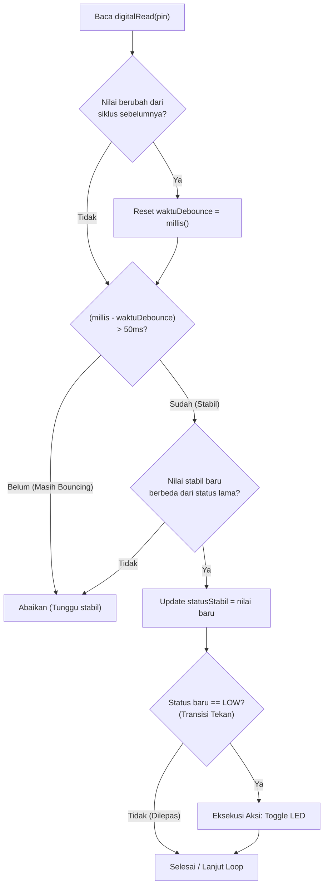

# Modul 05: Digital Input/Output, Sakelar & Debouncing

Modul ini membahas cara mengendalikan pin digital sebagai output dan input, menggunakan resistor pull-up internal untuk membaca tombol tanpa resistor eksternal tambahan, serta mengatasi masalah getaran mekanik sakelar (*contact bounce*) menggunakan algoritma software debouncing.

---

## 1. Komponen yang Digunakan

* 1x Arduino Uno R3
* 1x LED 5mm (Warna bebas, misal Merah)
* 1x Resistor $220\Omega$ (merah-merah-cokelat)
* 1x Push Button (Tactile Switch 4 pin)
* Breadboard dan kabel jumper secukupnya

---

## 2. Skema Rangkaian di Breadboard

```text
                        RANGKAIAN MODUL 05
                 +-------------------------------+
                 |        ARDUINO UNO R3         |
                 |                               |
                 |    Pin D7                     |
                 |       |                       |
                 |       | (Kabel Jumper)        |
                 |       v                       |
                 |   [Anoda LED]                 |
                 |       |                       |
                 |    (LED 5mm)                  |
                 |       |                       |
                 |   [Katoda LED]                |
                 |       |                       |
                 |   [Resistor 220 Ohm]          |
                 |       |                       |
                 |    Pin GND                    |
                 |                               |
                 |    Pin D2                     |
                 |       |                       |
                 |       +---- [Kaki A Button]   |
                 |                               |
                 |    Pin GND                    |
                 |       |                       |
                 |       +---- [Kaki B Button]   |
                 +-------------------------------+
```

### Langkah Perakitan:
1. Pasang LED di breadboard:
   * Hubungkan kaki panjang (**Anoda**) LED ke pin **D7** Arduino.
   * Hubungkan kaki pendek (**Katoda**) LED ke salah satu kaki resistor **$220\Omega$**.
   * Hubungkan kaki resistor yang lain ke pin **GND** Arduino.
2. Pasang Push Button:
   * Tancapkan push button melintasi parit pemisah tengah breadboard.
   * Hubungkan salah satu kakinya ke pin **D2** Arduino.
   * Hubungkan kaki pasangan sakelarnya ke pin **GND** Arduino.
   *(Kita tidak membutuhkan resistor eksternal untuk tombol karena kita akan mengaktifkan resistor pull-up bawaan chip ATmega328P).*

---

## 3. Logika Active-LOW dan Internal Pull-Up

Ketika pin tombol diatur menggunakan perintah:
```cpp
pinMode(PIN_BUTTON, INPUT_PULLUP);
```
Mikrokontroler menyambungkan resistor internal sebesar $20\text{k}\Omega - 50\text{k}\Omega$ antara pin D2 dan jalur tegangan 5V di dalam chip.

```text
       5V (Internal MCU)
         |
        [R Pull-Up 20-50k]
         |
         +---------------- Pin D2 (Dibaca oleh digitalRead)
         |
      [Tombol]
         |
        GND
```

Perhatikan konsekuensi logikanya (**Active-LOW**):
* **Saat tombol tidak ditekan**: Sirkuit ke GND terputus. Resistor pull-up menarik pin D2 ke 5V. Fungsi `digitalRead(PIN_BUTTON)` membaca logika **`HIGH`** ($1$).
* **Saat tombol ditekan**: Kaki tombol menghubungkan pin D2 langsung ke ground (0V). Fungsi `digitalRead(PIN_BUTTON)` membaca logika **`LOW`** ($0$).

---

## 4. Masalah Contact Bounce (Getaran Mekanik)

Saat Anda menekan push button, secara kasat mata tombol tampak tersambung seketika. Namun, di tingkat mikroskopis, pelat logam pegas di dalam tombol saling berbenturan dan memantul beberapa kali selama $5 - 20\text{ milidetik}$ sebelum benar-benar menempel rapat.

```text
Tegangan (V)
   5V |---
      |   |  | | |    |
   0V |   +--+-+-+----+-------------------------
      +-------------------------------------------> Waktu (ms)
          ^          ^
          Tombol     Kontak stabil
          mulai      tersambung
          ditekan    (Bounce berhenti setelah ~10ms)
```

Karena mikrokontroler mengeksekusi instruksi dalam hitungan puluhan nanodetik, mikrokontroler akan membaca pantulan cepat ini sebagai aksi penekanan tombol berkali-kali. Jika program Anda menghitung jumlah penekanan tombol, angka hitungan bisa melompat dari 1 langsung ke 4 atau 7 hanya dalam satu kali klik.

---

## 5. Solusi Software Debouncing

Untuk memfilter getaran mekanik ini, kita membuat aturan waktu:
> *"Jika pembacaan pin berubah status, abaikan perubahan berikutnya sampai sinyal bertahan stabil selama minimal 50 milidetik."*



### Program 1: Tombol Toggle LED dengan Debounce Stabil
Salin dan unggah kode berikut:

```cpp
// button_toggle.ino
// Menyalakan dan mematikan LED setiap kali tombol ditekan sekali (Toggle)

const uint8_t PIN_LED    = 7;
const uint8_t PIN_BUTTON = 2;

// Variabel status LED
bool statusLed = false;

// Variabel untuk melacak status tombol dan debouncing
int statusTombolTerakhir   = HIGH; // Karena INPUT_PULLUP, default = HIGH
int statusTombolSekarang;
uint32_t waktuDebounceTerakhir = 0;
const uint32_t JEDA_DEBOUNCE   = 50; // Waktu tunggu stabil (50 ms)

void setup() {
  pinMode(PIN_LED, OUTPUT);
  pinMode(PIN_BUTTON, INPUT_PULLUP);

  // Pastikan LED mati saat awal menyala
  digitalWrite(PIN_LED, LOW);
}

void loop() {
  // 1. Baca nilai pin tombol saat ini
  int pembacaan = digitalRead(PIN_BUTTON);

  // 2. Jika nilai pembacaan berubah (akibat noise atau pantulan kontak), reset timer
  if (pembacaan != statusTombolTerakhir) {
    waktuDebounceTerakhir = millis();
  }

  // 3. Jika nilai bertahan stabil lebih lama dari waktu debounce:
  if ((millis() - waktuDebounceTerakhir) > JEDA_DEBOUNCE) {
    // Periksa apakah status stabil ini benar-benar berbeda dari status sebelumnya
    if (pembacaan != statusTombolSekarang) {
      statusTombolSekarang = pembacaan;

      // Jalankan aksi hanya saat tombol BARU SAJA ditekan (transisi ke LOW)
      if (statusTombolSekarang == LOW) {
        statusLed = !statusLed; // Balik status (true -> false, false -> true)
        digitalWrite(PIN_LED, statusLed ? HIGH : LOW);
      }
    }
  }

  // 4. Simpan pembacaan untuk perbandingan di siklus berikutnya
  statusTombolTerakhir = pembacaan;
}
```

### Penjelasan Logika Kode:
1. `millis() - waktuDebounceTerakhir > JEDA_DEBOUNCE`: Memastikan pembacaan hanya diproses setelah sinyal tidak lagi berubah-ubah selama minimal 50ms.
2. `if (statusTombolSekarang == LOW)`: Memastikan aksi pembalikan LED (`statusLed = !statusLed`) hanya dieksekusi **satu kali pada momen tombol pertama kali menyentuh ground**, bukan berulang-ulang selama tombol ditahan.
3. Seluruh proses ini berjalan tanpa menggunakan `delay()`, sehingga CPU mikrokontroler tidak pernah terkunci.

---

## 6. Ringkasan

1. Mode `INPUT_PULLUP` mengaktifkan resistor internal $20-50\text{k}\Omega$ ke 5V, menyederhanakan kabel sirkuit tombol ke GND tanpa resistor luar.
2. Pada sirkuit pull-up (Active-LOW), logika `LOW` menandakan tombol ditekan, dan `HIGH` menandakan tombol dilepas.
3. *Contact bounce* adalah fenomena fisik getaran mekanik saat pelat sakelar bersentuhan ($5-20\text{ms}$).
4. Algoritma software debouncing memvalidasi perubahan sinyal dengan memastikan kondisi logika bertahan stabil melampaui jendela waktu debounce (misal 50ms).

---

Pada modul berikutnya, **[Modul 06: Pulse Width Modulation (PWM) & Dimmer LED](../06_pwm_dan_dimmer/README.md)**, kita akan mengontrol intensitas cahaya LED secara bertingkat menggunakan teknik modulasi lebar pulsa (PWM) dan mengatur kecerahannya menggunakan tombol.
