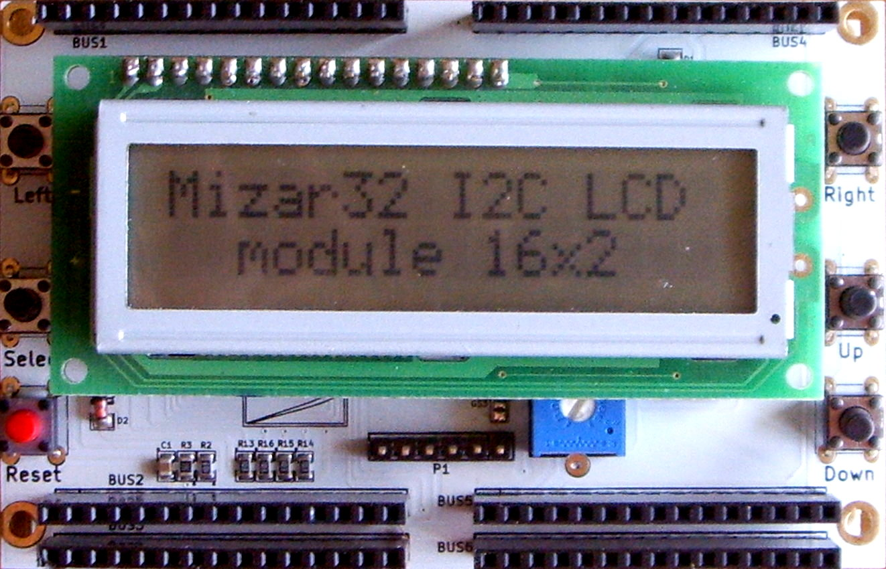

# Modul 07: Serial UART & Antarmuka I2C LCD 1602

Modul ini membahas dua metode komunikasi antarmuka data: pengiriman dan penerimaan perintah melalui Hardware Serial UART ke komputer, serta menampilkan informasi visual pada layar LCD 1602 menggunakan antarmuka bus I2C (PCF8574).

---

## 1. Komponen yang Digunakan

* 1x Arduino Uno R3
* 1x Modul LCD 1602 dengan backpack I2C (PCF8574)
* 2x Push Button
* Kabel jumper (Female-to-Male untuk LCD, Male-to-Male untuk tombol)
* Breadboard

---

## 2. Mengapa Memakai Backpack I2C pada LCD 1602?



LCD karakter standar 1602 (16 karakter $\times$ 2 baris) berbasis chip Hitachi HD44780 aslinya membutuhkan minimal 6 hingga 10 pin GPIO mikrokontroler untuk beroperasi dalam mode paralel (RS, EN, D4, D5, D6, D7, dll.).

Modul backpack hitam yang tersolder di belakang LCD menggunakan chip **PCF8574** (8-bit I/O expander). Chip ini mengubah antarmuka paralel tersebut menjadi protokol **I2C (Inter-Integrated Circuit)**, sehingga kita hanya membutuhkan **2 pin komunikasi data**:
1. **SDA (Serial Data)**: Terhubung ke pin **A4** pada Uno R3.
2. **SCL (Serial Clock)**: Terhubung ke pin **A5** pada Uno R3.

```text
                  PENGKABELAN LCD 1602 I2C
              +-------------------------------+
              |        ARDUINO UNO R3         |
              |                               |
              |    Pin 5V  ------------------------> VCC
              |    Pin GND ------------------------> GND   [Modul LCD 1602]
              |    Pin A4 (SDA) -------------------> SDA   (Backpack PCF8574)
              |    Pin A5 (SCL) -------------------> SCL
              |                               |
              |    Pin D2 -------------------------> Button 1 (Up) -> GND
              |    Pin D3 -------------------------> Button 2 (Down) -> GND
              +-------------------------------+
```

> [!IMPORTANT]
> **Masalah Layar Kosong atau Kotak Putih**:
> Di belakang modul I2C LCD terdapat trimpot kotak biru kecil. Jika setelah dinyalakan layar hanya menampilkan kotak putih atau tampak gelap kosong, putar trimpot tersebut menggunakan obeng kecil perlahan untuk mengatur **kontras tampilan** hingga karakter teks terbaca jelas.

---

## 3. Instalasi Library `LiquidCrystal_I2C`

1. Buka Arduino IDE 2.x.
2. Klik ikon **Library Manager** di bilah navigasi sebelah kiri (ikon tumpukan buku).
3. Ketik di kotak pencarian: `LiquidCrystal I2C`.
4. Pasang pustaka buatan **Frank de Brabander** (atau **Marco Schwartz**).

---

## 4. Alamat I2C: `0x27` vs `0x3F`

Setiap perangkat pada bus I2C memiliki alamat heksadesimal unik:
* Modul dengan chip **PCF8574T**: Alamat default umumnya **`0x27`**.
* Modul dengan chip **PCF8574AT**: Alamat default umumnya **`0x3F`**.

Jika program berjalan tetapi tidak ada teks yang muncul (meski kontras sudah diatur), ganti alamat di baris inisialisasi:
```cpp
LiquidCrystal_I2C lcd(0x27, 16, 2); // Coba ganti ke 0x3F jika 0x27 tidak merespons
```

---

## 5. Membuat Karakter Kustom (Custom Glyphs)

Chip HD44780 pada LCD menyediakan memori CGRAM (*Character Generator RAM*) untuk membuat hingga 8 karakter buatan sendiri berukuran $5 \times 8$ piksel.

Setiap baris piksel direpresentasikan sebagai satu byte biner (`B00000` s/d `B11111`):

```cpp
// Contoh: Karakter Ikon Baterai Penuh
const uint8_t ikonBaterai[8] = {
  B01110, //   ###
  B11111, //  #####
  B10001, //  #   #
  B11111, //  #####
  B11111, //  #####
  B11111, //  #####
  B11111, //  #####
  B11111  //  #####
};
```

Karakter didaftarkan di `setup()` menggunakan `lcd.createChar(indeks, array)` dan ditampilkan menggunakan `lcd.write(indeks)`.

---

## 6. Program Praktik: Antarmuka Interaktif LCD 1602 & Serial

Program ini menampilkan counter interaktif di layar LCD 1602. Dua tombol fisik (D2 dan D3) digunakan untuk menambah dan mengurangi nilai counter. Selain itu, komputer dapat mengirim karakter `+`, `-`, atau `r` (reset) lewat Serial Monitor untuk mengendalikan nilai dari jarak jauh.

```cpp
// lcd1602_interactive.ino
// Menampilkan counter interaktif pada I2C LCD 1602 dengan kontrol Tombol & Serial

#include <Wire.h>
#include <LiquidCrystal_I2C.h>

// Inisialisasi LCD pada alamat 0x27, 16 kolom x 2 baris
LiquidCrystal_I2C lcd(0x27, 16, 2);

const uint8_t PIN_BTN_UP   = 2;
const uint8_t PIN_BTN_DOWN = 3;

int counter = 0;

// Pelacak status tombol
int statusUpTerakhir     = HIGH;
int statusDownTerakhir   = HIGH;
uint32_t waktuUpTerakhir   = 0;
uint32_t waktuDownTerakhir = 0;
const uint32_t JEDA_DEBOUNCE = 50;

// Karakter kustom: Ikon Panah Naik (Indeks 0) dan Panah Turun (Indeks 1)
const uint8_t panahAtas[8] = {
  B00100,
  B01110,
  B10101,
  B00100,
  B00100,
  B00100,
  B00100,
  B00000
};

const uint8_t panahBawah[8] = {
  B00100,
  B00100,
  B00100,
  B00100,
  B10101,
  B01110,
  B00100,
  B00000
};

void setup() {
  pinMode(PIN_BTN_UP, INPUT_PULLUP);
  pinMode(PIN_BTN_DOWN, INPUT_PULLUP);

  Serial.begin(115200);
  Serial.println(F("Sistem Antarmuka LCD Siap."));
  Serial.println(F("Ketik '+' untuk naik, '-' untuk turun, 'r' untuk reset."));

  // Inisialisasi layar LCD
  lcd.init();
  lcd.backlight();

  // Daftarkan karakter kustom
  lcd.createChar(0, (uint8_t*)panahAtas);
  lcd.createChar(1, (uint8_t*)panahBawah);

  // Tampilkan tampilan awal
  perbaruiTampilanLcd();
}

void loop() {
  uint32_t sekarang = millis();
  bool perluUpdateLcd = false;

  // --- 1. Baca Tombol UP (D2) ---
  int bacaUp = digitalRead(PIN_BTN_UP);
  if (bacaUp != statusUpTerakhir) waktuUpTerakhir = sekarang;
  if ((sekarang - waktuUpTerakhir) > JEDA_DEBOUNCE) {
    static int statusUpStabil = HIGH;
    if (bacaUp != statusUpStabil) {
      statusUpStabil = bacaUp;
      if (statusUpStabil == LOW) {
        counter++;
        perluUpdateLcd = true;
      }
    }
  }
  statusUpTerakhir = bacaUp;

  // --- 2. Baca Tombol DOWN (D3) ---
  int bacaDown = digitalRead(PIN_BTN_DOWN);
  if (bacaDown != statusDownTerakhir) waktuDownTerakhir = sekarang;
  if ((sekarang - waktuDownTerakhir) > JEDA_DEBOUNCE) {
    static int statusDownStabil = HIGH;
    if (bacaDown != statusDownStabil) {
      statusDownStabil = bacaDown;
      if (statusDownStabil == LOW) {
        counter--;
        perluUpdateLcd = true;
      }
    }
  }
  statusDownTerakhir = bacaDown;

  // --- 3. Baca Perintah Serial UART dari Komputer ---
  while (Serial.available() > 0) {
    char karakter = (char)Serial.read();
    if (karakter == '+') {
      counter++;
      perluUpdateLcd = true;
    } else if (karakter == '-') {
      counter--;
      perluUpdateLcd = true;
    } else if (karakter == 'r' || karakter == 'R') {
      counter = 0;
      perluUpdateLcd = true;
    }
  }

  // --- 4. Perbarui Tampilan Hanya Jika Ada Perubahan Nilai ---
  if (perluUpdateLcd) {
    perbaruiTampilanLcd();
  }
}

void perbaruiTampilanLcd() {
  // Baris 0: Judul & Ikon
  lcd.setCursor(0, 0);
  lcd.print(F("PANEL KONTROL "));
  lcd.write(0); // Tampilkan ikon panah atas
  lcd.write(1); // Tampilkan ikon panah bawah

  // Baris 1: Nilai Counter (Dibersihkan dengan spasi untuk mencegah teks tumpang tindih)
  lcd.setCursor(0, 1);
  char buffer[17];
  snprintf(buffer, sizeof(buffer), "Nilai: %-6d   ", counter);
  lcd.print(buffer);

  // Laporkan juga ke Serial Monitor
  Serial.print(F("Nilai Counter Terkini: "));
  Serial.println(counter);
}
```

### Mengapa Kita Menggunakan `perluUpdateLcd`?
Mengirim data ke layar LCD melalui bus I2C memakan waktu sekitar beberapa milidetik. Jika kita memanggil `lcd.print()` berulang-ulang di setiap siklus `loop()` tanpa henti, tampilan layar akan berkedip (*flicker*) dan pemrosesan tombol menjadi lambat. Dengan teknik flag `perluUpdateLcd`, layar **hanya digambar ulang saat data benar-benar berubah**.

---

## 7. Ringkasan

1. Modul backpack I2C (PCF8574) memangkas kabel LCD 1602 dari 16 pin paralel menjadi hanya 2 pin data (SDA di A4, SCL di A5).
2. Trimpot biru di belakang backpack berfungsi mengatur kontras tampilan layar.
3. Alamat I2C default adalah `0x27` (chip PCF8574T) atau `0x3F` (chip PCF8574AT).
4. Hindari memperbarui tampilan LCD secara terus-menerus di dalam `loop()`; perbarui hanya saat ada perubahan data untuk mencegah kedipan layar.

---

Pada modul berikutnya, **[Modul 08: Kendali Beban Tinggi dengan Modul Relay 5V](../08_kendali_relay/README.md)**, kita akan menghubungkan aktuator relay 5V untuk mengendalikan beban daya tinggi secara aman dengan proteksi isolasi optik.
