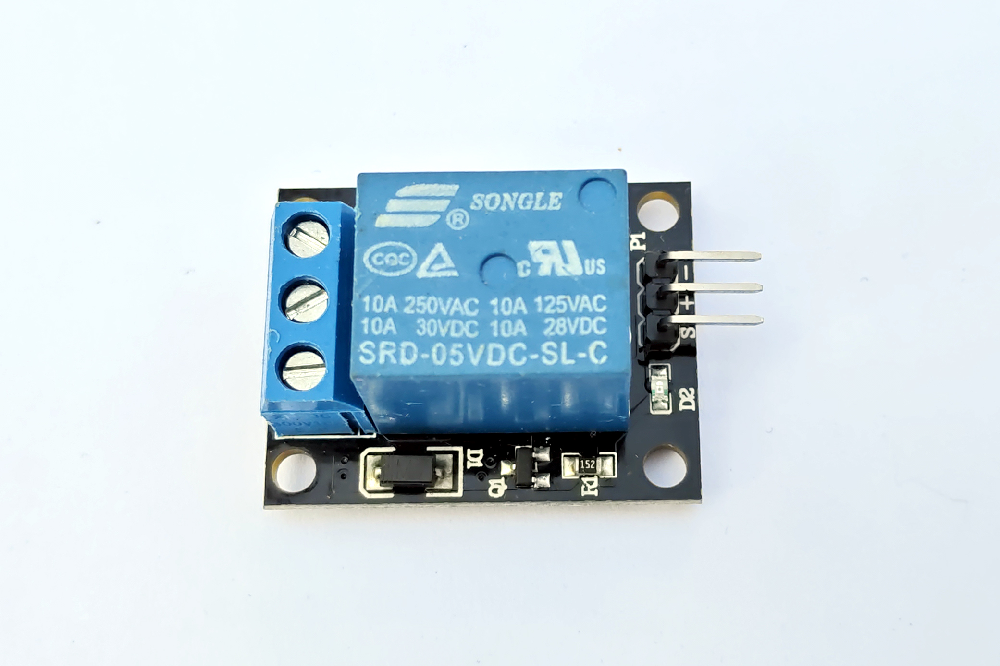
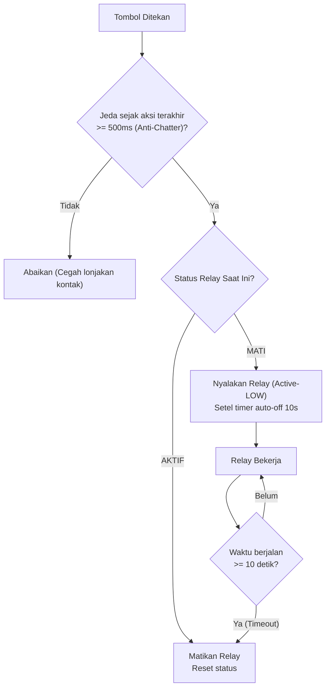

# Modul 08: Kendali Beban Tinggi dengan Modul Relay 5V

Modul ini membahas cara mengendalikan perangkat berdaya tinggi secara aman menggunakan modul relay 5V, memahami logika kontrol Active-LOW vs Active-HIGH, konfigurasi terminal NO/NC/COM, serta menerapkan proteksi timeout dan anti-chatter pada software.

---

## 1. Komponen yang Digunakan

* 1x Arduino Uno R3
* 1x Modul Relay 5V (1 Channel dengan Optocoupler)
* 1x I2C LCD 1602
* 1x Push Button
* 1x LED Merah + Resistor $220\Omega$ (sebagai simulasi beban listrik)
* Breadboard dan kabel jumper

---

## 2. Cara Kerja Modul Relay 5V



Relay bekerja sebagai sakelar mekanik yang ditarik oleh elektromagnet. Saat arus listrik dialirkan ke kumparan internal (koil), terbentuk medan magnet yang menarik tuas besi ke bawah, menghubungkan pelat kontak sakelar dengan bunyi klik khas.

```text
              SISI INPUT (5V)                   SISI OUTPUT (BEBAN)
                                                +--- NO (Normally Open)
     Pin D8 ---> [Optocoupler] ---> [Koil 5V] =/
     GND   ---> [  PC817     ]      [Diode D ] -----+--- COM (Common)
                                                \
                                                 +--- NC (Normally Closed)
```

### 2.1 Terminal Sisi Beban:
1. **COM (Common)**: Terminal poros sakelar. Hubungkan salah satu kabel dari sumber tegangan beban ke terminal ini.
2. **NO (Normally Open)**: Dalam kondisi relay mati, terminal ini **terputus** dari COM. Begitu relay diaktifkan, NO akan terhubung ke COM. Ini adalah konfigurasi yang paling umum digunakan untuk sakelar lampu atau pompa.
3. **NC (Normally Closed)**: Dalam kondisi relay mati, terminal ini **sudah tersambung** ke COM. Saat relay aktif, kontak NC justru akan terputus.

### 2.2 Logika Active-LOW (Penting)
Mayoritas modul relay 5V yang beredar di pasaran menggunakan logika **Active-LOW**:
* `digitalWrite(PIN_RELAY, LOW)` $\rightarrow$ Relay **AKTIF** (terdengar bunyi klik, lampu indikator modul menyala, kontak NO terhubung ke COM).
* `digitalWrite(PIN_RELAY, HIGH)` $\rightarrow$ Relay **MATI** (kontak NO terputus dari COM).

> [!TIP]
> **Mencegah Relay Menyala Sesaat Saat Booting**:
> Secara default, pin Arduino berstatus `LOW` (0V) saat mikrokontroler baru menyala sebelum baris `pinMode()` dieksekusi. Jika modul Anda Active-LOW, relay bisa terpicu sesaat saat dinyalakan.
> Untuk mencegahnya, tulis logika `HIGH` terlebih dahulu sebelum mengatur `OUTPUT`:
> ```cpp
> digitalWrite(PIN_RELAY, HIGH); // Setel HIGH terlebih dahulu
> pinMode(PIN_RELAY, OUTPUT);     // Baru aktifkan sebagai output
> ```

---

## 3. Skema Rangkaian

```text
                  PENGKABELAN MODUL 08
              +-------------------------------+
              |        ARDUINO UNO R3         |
              |                               |
              |    Pin 5V  ------------------------> VCC (Relay & LCD)
              |    Pin GND ------------------------> GND (Relay & LCD)
              |    Pin A4 (SDA) -------------------> SDA (LCD 1602)
              |    Pin A5 (SCL) -------------------> SCL (LCD 1602)
              |                               |
              |    Pin D8 (Kontrol Relay) ---------> IN  (Modul Relay 5V)
              |    Pin D2 (Tombol Pemicu) ---------> Button -> GND
              |                               |
              |    Pin D7 (Indikator) -------------> Anoda LED -> R 220 -> GND
              +-------------------------------+

       Sisi Beban Relay:
       Pin 5V Arduino ----> Terminal COM Relay
       Pin NO Relay   ----> Anoda LED Beban Eksternal (atau beban simulasi)
```

---

## 4. Fitur Keselamatan Software: Anti-Chatter & Auto-Cutoff

Dalam kendali industri, sakelar relay tidak boleh dibiarkan berganti status terlalu cepat (*chatter*) karena percikan api pada kontak logam akan mengikis permukaan kontak (*contact wear*) dan memperpendek usia relay.

Kita menambahkan dua proteksi software:
1. **Anti-Chatter Delay**: Membatasi pergantian status relay minimal berjarak 500 milidetik antar aksi.
2. **Auto-Cutoff Timer**: Jika relay diaktifkan, sistem otomatis mematikannya setelah 10 detik untuk mencegah beban (seperti pemanas atau solenoid) menyala tanpa batas akibat kelalaian pengguna.



---

## 5. Program Praktik: Pengendali Relay dengan Timer & LCD

```cpp
// relay_timer_controller.ino
// Mengendalikan modul relay 5V (Active-LOW) dengan tombol toggle, auto-cutoff timer, dan status LCD

#include <Wire.h>
#include <LiquidCrystal_I2C.h>

LiquidCrystal_I2C lcd(0x27, 16, 2);

const uint8_t PIN_RELAY  = 8;  // Pin kontrol modul relay (Active-LOW)
const uint8_t PIN_BTN    = 2;  // Tombol toggle manual
const uint8_t PIN_LED    = 7;  // LED indikator status

// Definisi logika Active-LOW agar kode mudah dibaca
const uint8_t RELAY_ON  = LOW;
const uint8_t RELAY_OFF = HIGH;

bool statusRelayAktif = false;
uint32_t waktuMulaiRelay = 0;
const uint32_t DURASI_AUTO_OFF = 10000; // Mati otomatis setelah 10 detik (10.000 ms)

// Debouncing tombol
int statusTombolTerakhir = HIGH;
uint32_t waktuDebounce   = 0;
const uint32_t JEDA_DEBOUNCE = 50;

// Proteksi anti-chatter (minimal jeda 500ms sebelum boleh berganti status lagi)
uint32_t waktuAksiRelayTerakhir = 0;
const uint32_t JEDA_ANTI_CHATTER = 500;

void perbaruiTampilanLcd(int sisaDetik);

void setup() {
  // Cegah relay aktif sesaat saat booting
  digitalWrite(PIN_RELAY, RELAY_OFF);
  pinMode(PIN_RELAY, OUTPUT);

  pinMode(PIN_LED, OUTPUT);
  digitalWrite(PIN_LED, LOW);

  pinMode(PIN_BTN, INPUT_PULLUP);

  Serial.begin(115200);
  Serial.println(F("Pengendali Relay Siap."));

  lcd.init();
  lcd.backlight();
  perbaruiTampilanLcd(0);
}

void loop() {
  uint32_t sekarang = millis();

  // --- 1. Baca Tombol Manual ---
  int bacaTombol = digitalRead(PIN_BTN);
  if (bacaTombol != statusTombolTerakhir) {
    waktuDebounce = sekarang;
  }
  if ((sekarang - waktuDebounce) > JEDA_DEBOUNCE) {
    static int statusStabil = HIGH;
    if (bacaTombol != statusStabil) {
      statusStabil = bacaTombol;
      if (statusStabil == LOW) {
        // Cek proteksi anti-chatter
        if (sekarang - waktuAksiRelayTerakhir >= JEDA_ANTI_CHATTER) {
          waktuAksiRelayTerakhir = sekarang;

          // Toggle status relay
          if (!statusRelayAktif) {
            aktifkanRelay(sekarang);
          } else {
            matikanRelay();
          }
        }
      }
    }
  }
  statusTombolTerakhir = bacaTombol;

  // --- 2. Periksa Auto-Cutoff Timer ---
  if (statusRelayAktif) {
    uint32_t waktuBerjalan = sekarang - waktuMulaiRelay;
    if (waktuBerjalan >= DURASI_AUTO_OFF) {
      Serial.println(F("Timeout tercapai: Relay dimatikan otomatis."));
      matikanRelay();
    } else {
      // Perbarui hitungan mundur di LCD setiap 500ms
      static uint32_t waktuUpdateLcd = 0;
      if (sekarang - waktuUpdateLcd >= 500) {
        waktuUpdateLcd = sekarang;
        int sisaDetik = (DURASI_AUTO_OFF - waktuBerjalan) / 1000 + 1;
        perbaruiTampilanLcd(sisaDetik);
      }
    }
  }
}

void aktifkanRelay(uint32_t waktuMulai) {
  statusRelayAktif = true;
  waktuMulaiRelay = waktuMulai;
  digitalWrite(PIN_RELAY, RELAY_ON);
  digitalWrite(PIN_LED, HIGH);

  Serial.println(F("Relay: AKTIF (Timer 10 detik berjalan)"));
  perbaruiTampilanLcd(10);
}

void matikanRelay() {
  statusRelayAktif = false;
  digitalWrite(PIN_RELAY, RELAY_OFF);
  digitalWrite(PIN_LED, LOW);

  Serial.println(F("Relay: MATI (Standby)"));
  perbaruiTampilanLcd(0);
}

void perbaruiTampilanLcd(int sisaDetik) {
  lcd.setCursor(0, 0);
  lcd.print(F("STATUS: "));
  if (statusRelayAktif) {
    lcd.print(F("[AKTIF] "));
  } else {
    lcd.print(F("[STANDBY]"));
  }

  lcd.setCursor(0, 1);
  char buffer[17];
  if (statusRelayAktif) {
    snprintf(buffer, sizeof(buffer), "Auto-off: %2d s   ", sisaDetik);
  } else {
    snprintf(buffer, sizeof(buffer), "Tekan D2 -> ON  ");
  }
  lcd.print(buffer);
}
```

---

## 6. Ringkasan

1. Modul relay memisahkan sirkuit mikrokontroler 5V berdaya rendah dari sirkuit beban tegangan tinggi secara mekanis dan optik.
2. Kebanyakan modul relay 5V bersifat **Active-LOW** (logika `LOW` mengaktifkan relay).
3. Terminal **NO (Normally Open)** menghubungkan beban hanya saat relay menerima sinyal aktif, sementara terminal **NC (Normally Closed)** menghubungkan beban saat relay mati.
4. Menerapkan proteksi software seperti batas jeda anti-chatter dan auto-cutoff timer sangat dianjurkan untuk mencegah keausan kontak logam dan bahaya panas berlebih pada beban.

---

Pada modul berikutnya, **[Modul 09: Protokol Bus I2C & Memori Non-Volatile (EEPROM)](../09_bus_i2c_dan_eeprom/README.md)**, kita akan membedah protokol bus I2C secara mendalam dengan membuat program I2C scanner sendiri, serta menggunakan memori EEPROM internal ATmega328P untuk menyimpan status relay secara permanen agar tidak ter-reset saat listrik padam.
