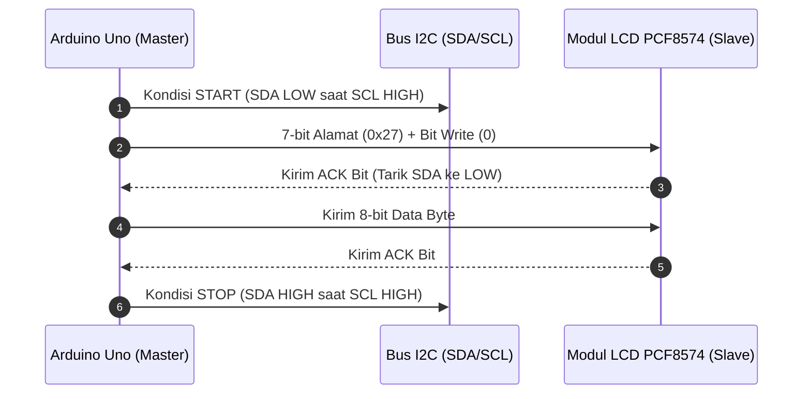
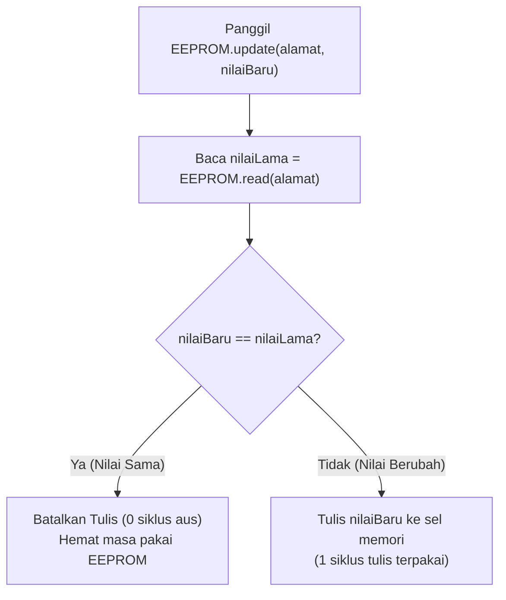

# Modul 09: Protokol Bus I2C & Memori Non-Volatile (EEPROM)

Modul ini membedah dua topik penting dalam sistem embedded: cara kerja komunikasi bus **I2C (Inter-Integrated Circuit)** hingga tingkat transaksi biner, serta pemanfaatan memori penyimpanan permanen **EEPROM** pada ATmega328P untuk menyimpan konfigurasi dan status perangkat agar tidak hilang saat listrik padam (*State Persistence*).

---

## 1. Membedah Protokol Bus I2C (Two-Wire Interface)

Protokol I2C diciptakan oleh Philips Semiconductor (sekarang NXP) untuk menghubungkan mikroprosesor dengan sirkuit terpadu berkecepatan rendah menggunakan kabel sesedikit mungkin.

### 1.1 Dua Jalur Komunikasi
* **SDA (Serial Data)**: Jalur pengiriman data biner (terhubung ke pin **A4** pada Uno R3).
* **SCL (Serial Clock)**: Jalur pulsa clock sinkronisasi yang dikendalikan oleh Master (terhubung ke pin **A5** pada Uno R3).

```text
       VCC (+5V)
         |
        [R] [R]  <-- Resistor Pull-Up (4.7k - 10k Ohm)
         |   |
  SDA ---+---+----------+-------------------+
             |          |                   |
  SCL -------+----------+--------+          |
                        |        |          |
                   +----+----+   |     +----+----+
                   | Arduino |   |     | LCD1602 |
                   | Uno R3  |   +---- | PCF8574 |
                   | (Master)|         | (Slave) |
                   +---------+         +---------+
```

### 1.2 Topologi Open-Drain & Resistor Pull-Up
Jalur SDA dan SCL bertipe *open-drain* (atau *open-collector*). Artinya, mikrokontroler atau modul periferal hanya dapat menarik jalur ke bawah (0V / LOW) atau membiarkannya mengambang. 
Dua resistor pull-up eksternal ($4.7\text{k}\Omega - 10\text{k}\Omega$) bertugas menarik tegangan jalur ke 5V saat tidak ada perangkat yang aktif menariknya ke ground.
*(Pada modul I2C LCD 1602 PCF8574, resistor pull-up ini sudah tersolder rapi di atas papan modul).*

### 1.3 Alur Transaksi Data I2C
1. **START Condition**: Master menarik jalur SDA ke `LOW` saat SCL masih berada di logika `HIGH`.
2. **Address Frame (7-bit)**: Master mengirim 7-bit alamat target (misal `0x27`) diikuti 1-bit arah (0 = Write, 1 = Read).
3. **ACK/NACK Bit (Acknowledge)**: Jika ada slave dengan alamat tersebut di bus, slave akan menarik SDA ke `LOW` pada siklus clock ke-9 sebagai tanda konfirmasi (ACK).
4. **Data Frame (8-bit)**: Data ditransfer byte per byte, masing-masing diikuti 1 bit ACK.
5. **STOP Condition**: Master melepaskan SDA ke `HIGH` saat SCL berada di logika `HIGH`.



---

## 2. Program 1: I2C Scanner Mandiri

Sebelum memprogram modul I2C baru, langkah diagnostik wajib adalah menjalankan program pemindai alamat I2C (*I2C Scanner*). Program ini mengetuk alamat `1` sampai `126`. Jika ada perangkat yang membalas dengan bit `ACK`, alamatnya akan dicetak ke Serial Monitor.

```cpp
// i2c_scanner.ino
// Memindai seluruh alamat pada bus I2C (Wire.h) dan menampilkan perangkat yang terdeteksi

#include <Wire.h>

void setup() {
  Wire.begin();
  Serial.begin(115200);
  while (!Serial); // Tunggu Serial Monitor terbuka
  Serial.println(F("\n--- I2C Bus Scanner ---"));
}

void loop() {
  uint8_t jumlahPerangkat = 0;
  Serial.println(F("Memindai bus I2C..."));

  for (uint8_t alamat = 1; alamat < 127; alamat++) {
    // Kirim sinyal transmisi tes ke alamat target
    Wire.beginTransmission(alamat);
    uint8_t error = Wire.endTransmission();

    if (error == 0) {
      Serial.print(F("Perangkat ditemukan pada alamat 0x"));
      if (alamat < 16) Serial.print(F("0"));
      Serial.print(alamat, HEX);
      Serial.println(F(" !"));
      jumlahPerangkat++;
    } else if (error == 4) {
      Serial.print(F("Error tidak dikenal pada alamat 0x"));
      if (alamat < 16) Serial.print(F("0"));
      Serial.println(alamat, HEX);
    }
  }

  if (jumlahPerangkat == 0) {
    Serial.println(F("Tidak ada perangkat I2C yang terdeteksi. Periksa kabel SDA/SCL."));
  } else {
    Serial.print(F("Selesai. Ditemukan "));
    Serial.print(jumlahPerangkat);
    Serial.println(F(" perangkat.\n"));
  }

  delay(5000); // Pindai ulang setiap 5 detik
}
```

---

## 3. Memori Non-Volatile Internal (EEPROM)

Mikrokontroler ATmega328P memiliki memori **EEPROM (Electrically Erasable Programmable Read-Only Memory)** bawaan berukuran **1.024 byte (1 KB)**.

### 3.1 Karakteristik Penting EEPROM:
* **Non-Volatile**: Data yang tertulis tetap tersimpan permanen meskipun kabel USB dicabut atau listrik padam selama bertahun-tahun.
* **Batas Siklus Tulis (Write Endurance)**: Setiap sel byte EEPROM memiliki batas ketahanan sekitar **100.000 kali penulisan**. Membaca data (`EEPROM.read`) tidak memiliki batasan (unlimited).
* **Peringatan Kritis**: Jangan pernah menulis ke EEPROM di dalam fungsi `loop()` tanpa jeda atau kondisi pengecekan, karena 100.000 siklus tulis bisa habis hanya dalam beberapa menit dan merusak sel memori secara permanen!

### 3.2 Fungsi `EEPROM.update()` vs `EEPROM.write()`
* `EEPROM.write(alamat, nilai)`: Selalu menimpa byte baru ke memori terlepas dari apakah nilainya berubah atau tidak.
* `EEPROM.update(alamat, nilai)`: Membaca isi alamat terlebih dahulu. Jika nilai baru **sama persis** dengan nilai yang sudah ada, operasi tulis **dibatalkan**. Ini sangat menghemat siklus usia pakai EEPROM!



### 3.3 Menyimpan Tipe Data Kompleks: `EEPROM.put()` dan `EEPROM.get()`
Pustaka bawaan Arduino menyediakan dua fungsi untuk menyimpan struct atau variabel multi-byte secara instan:

```cpp
#include <EEPROM.h>

struct KonfigurasiSistem {
  uint32_t totalBoot;
  bool statusRelayTerakhir;
  uint16_t durasiTimer;
};

KonfigurasiSistem config;

// Menyimpan seluruh struct ke alamat awal 0 (otomatis memakai logika update di balik layar)
EEPROM.put(0, config);

// Membaca kembali seluruh struct dari alamat 0
EEPROM.get(0, config);
```

---

## 4. Program Praktik: State Persistence pada Relay & Counter

Program ini mencatat jumlah boot sistem ke EEPROM dan mengingat status sakelar relay terakhir. Jika relay sedang AKTIF lalu listrik padam, begitu listrik menyala kembali Arduino akan membaca EEPROM dan langsung mengembalikan relay ke status semula secara otomatis.

```cpp
// eeprom_state_persistence.ino
// Menyimpan status relay dan counter operasional ke EEPROM internal secara persisten

#include <Wire.h>
#include <LiquidCrystal_I2C.h>
#include <EEPROM.h>

LiquidCrystal_I2C lcd(0x27, 16, 2);

const uint8_t PIN_RELAY  = 8;
const uint8_t PIN_BTN_TOGGLE = 2; // Tombol ubah status relay
const uint8_t PIN_BTN_RESET  = 3; // Tombol reset data EEPROM
const uint8_t PIN_LED        = 7;

const uint8_t RELAY_ON  = LOW;
const uint8_t RELAY_OFF = HIGH;

// Struktur data yang disimpan ke EEPROM
struct DataSimpanan {
  uint16_t magicNumber; // Penanda validitas data (0xABCD)
  uint32_t counterOperasi;
  bool statusRelay;
};

const uint16_t KODE_VALID = 0xABCD;
const int ALAMAT_EEPROM    = 0;

DataSimpanan memori;

// Debouncing
int statusToggleTerakhir = HIGH;
int statusResetTerakhir  = HIGH;
uint32_t waktuToggle     = 0;
uint32_t waktuReset      = 0;
const uint32_t JEDA_DEBOUNCE = 50;

void perbaruiTampilan();
void simpanKeEeprom();

void setup() {
  pinMode(PIN_RELAY, OUTPUT);
  pinMode(PIN_LED, OUTPUT);
  pinMode(PIN_BTN_TOGGLE, INPUT_PULLUP);
  pinMode(PIN_BTN_RESET, INPUT_PULLUP);

  Serial.begin(115200);
  Serial.println(F("\n--- Sistem State Persistence EEPROM ---"));

  // 1. Baca data dari EEPROM
  EEPROM.get(ALAMAT_EEPROM, memori);

  // Jika data belum pernah diinisialisasi (misal chip baru atau nilai acak):
  if (memori.magicNumber != KODE_VALID) {
    Serial.println(F("Inisialisasi memori EEPROM baru..."));
    memori.magicNumber    = KODE_VALID;
    memori.counterOperasi = 0;
    memori.statusRelay    = false;
    simpanKeEeprom();
  } else {
    Serial.println(F("Data valid ditemukan di EEPROM."));
  }

  // 2. Pulihkan status relay dan LED ke kondisi terakhir sebelum mati daya
  if (memori.statusRelay) {
    digitalWrite(PIN_RELAY, RELAY_ON);
    digitalWrite(PIN_LED, HIGH);
    Serial.println(F("Status dipulihkan: Relay AKTIF."));
  } else {
    digitalWrite(PIN_RELAY, RELAY_OFF);
    digitalWrite(PIN_LED, LOW);
    Serial.println(F("Status dipulihkan: Relay MATI."));
  }

  lcd.init();
  lcd.backlight();
  perbaruiTampilan();
}

void loop() {
  uint32_t sekarang = millis();

  // --- Tombol 1: Toggle Relay & Simpan Status ---
  int bacaToggle = digitalRead(PIN_BTN_TOGGLE);
  if (bacaToggle != statusToggleTerakhir) waktuToggle = sekarang;
  if ((sekarang - waktuToggle) > JEDA_DEBOUNCE) {
    static int statusToggleStabil = HIGH;
    if (bacaToggle != statusToggleStabil) {
      statusToggleStabil = bacaToggle;
      if (statusToggleStabil == LOW) {
        // Balik status relay
        memori.statusRelay = !memori.statusRelay;
        memori.counterOperasi++;

        digitalWrite(PIN_RELAY, memori.statusRelay ? RELAY_ON : RELAY_OFF);
        digitalWrite(PIN_LED, memori.statusRelay ? HIGH : LOW);

        simpanKeEeprom();
        perbaruiTampilan();
      }
    }
  }
  statusToggleTerakhir = bacaToggle;

  // --- Tombol 2: Reset Counter EEPROM ---
  int bacaReset = digitalRead(PIN_BTN_RESET);
  if (bacaReset != statusResetTerakhir) waktuReset = sekarang;
  if ((sekarang - waktuReset) > JEDA_DEBOUNCE) {
    static int statusResetStabil = HIGH;
    if (bacaReset != statusResetStabil) {
      statusResetStabil = bacaReset;
      if (statusResetStabil == LOW) {
        memori.counterOperasi = 0;
        simpanKeEeprom();
        perbaruiTampilan();
        Serial.println(F("Counter di-reset ke 0."));
      }
    }
  }
  statusResetTerakhir = bacaReset;
}

void simpanKeEeprom() {
  EEPROM.put(ALAMAT_EEPROM, memori);
  Serial.print(F("EEPROM Disimpan | Counter: "));
  Serial.print(memori.counterOperasi);
  Serial.print(F(" | Relay: "));
  Serial.println(memori.statusRelay ? F("ON") : F("OFF"));
}

void perbaruiTampilan() {
  lcd.setCursor(0, 0);
  char baris0[17];
  snprintf(baris0, sizeof(baris0), "Relay: %-4s Cnt:%-3lu", 
           memori.statusRelay ? "ON" : "OFF", 
           memori.counterOperasi);
  lcd.print(baris0);

  lcd.setCursor(0, 1);
  lcd.print(F("D2:Tgl  D3:Reset"));
}
```

### Simulasi Interaktif Wokwi:
* **Tautan Proyek Simulasi (EEPROM State Persistence)**: [Simulasi Wokwi - Modul 09: EEPROM State Persistence](https://wokwi.com/projects/475528078042644481)
* **Tautan Proyek Simulasi (I2C Scanner)**: [Simulasi Wokwi - Modul 09: I2C Scanner](https://wokwi.com/projects/475528144194164737)
* File diagram sirkuit dan kode program tersedia di direktori [code/eeprom_state_persistence/](code/eeprom_state_persistence/) dan [code/i2c_scanner/](code/i2c_scanner/).

---

## 5. Ringkasan

1. Bus I2C menggunakan arsitektur open-drain dengan resistor pull-up pada jalur SDA (A4) dan SCL (A5).
2. Program I2C Scanner mendeteksi alamat perangkat keras yang aktif dengan mendengarkan bit konfirmasi `ACK`.
3. Memori EEPROM internal ATmega328P berukuran 1.024 byte dan mampu mempertahankan data tanpa catu daya.
4. Selalu gunakan `EEPROM.update()` atau `EEPROM.put()` alih-alih `EEPROM.write()` untuk melindungi sel memori dari batas aus 100.000 kali penulisan.

---

Pada modul penutup, **[Modul 10: Arsitektur Embedded Menengah, FSM & Capstone Project](../10_arsitektur_fsm_interrupt_capstone/README.md)**, kita akan merangkai seluruh konsep menjadi satu sistem otomasi industri utuh: arsitektur non-blocking multitasking, Finite State Machine (FSM), dan tombol darurat interupsi perangkat keras (Hardware Interrupt).
