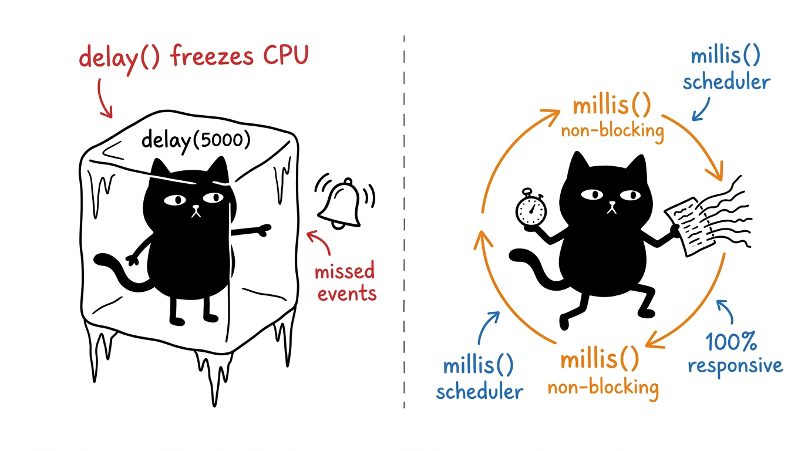
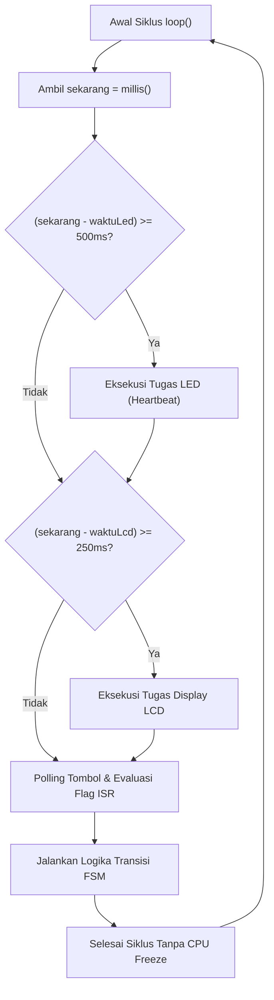
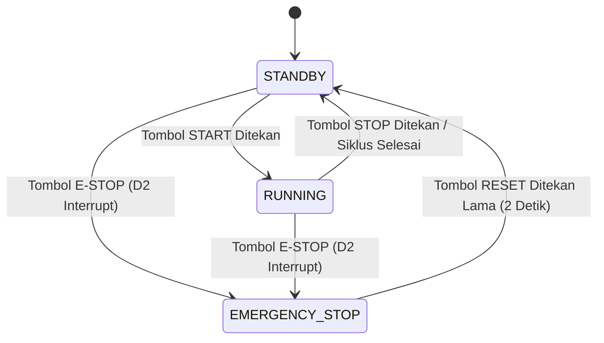
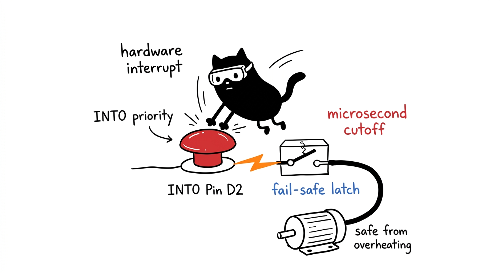

# Modul 10: Arsitektur Embedded Menengah, FSM, Interrupt & Capstone Project

Modul pamungkas ini menyatukan seluruh pengetahuan yang telah kita pelajari dari Modul 01 hingga Modul 09 menjadi arsitektur perangkat lunak embedded tingkat menengah yang tangguh. Kita akan mengeliminasi fungsi pemblokir CPU (`delay`), merancang sistem kendali berbasis **Finite State Machine (FSM)**, menangani tombol darurat instan menggunakan **Hardware External Interrupt**, dan merakit proyek capstone terpadu: **Smart Industrial Relay Controller**.

---

## 1. Menyingkirkan `delay()`: Multitasking Kooperatif



Di modul-modul awal, fungsi `delay()` sering digunakan untuk menunggu waktu. Namun, pada sistem industri nyata, `delay()` adalah pantangan fatal karena **membekukan CPU mikrokontroler secara total**.

Jika Anda menulis `delay(5000)`:
* Mikrokontroler hanya menghitung siklus kosong (*no-op*) selama 5 detik.
* Selama 5 detik itu, tombol yang ditekan pengguna tidak akan terbaca.
* Sensor atau kondisi darurat tidak dapat dideteksi tepat waktu.

### Pola Penjadwal Non-Blocking (Task Scheduler Pattern)
Kita membagi program menjadi tugas-tugas kecil yang berjalan pada interval independen menggunakan fungsi `millis()`:

```cpp
uint32_t waktuLedTerakhir = 0;
uint32_t waktuLcdTerakhir = 0;

void loop() {
  uint32_t sekarang = millis();

  // Tugas 1: Mengedipkan LED indikator setiap 500 ms
  if (sekarang - waktuLedTerakhir >= 500) {
    waktuLedTerakhir = sekarang;
    kedipkanLed();
  }

  // Tugas 2: Memperbarui tampilan LCD setiap 250 ms
  if (sekarang - waktuLcdTerakhir >= 250) {
    waktuLcdTerakhir = sekarang;
    perbaruiLcd();
  }

  // Tugas 3: Membaca input tombol terus-menerus di setiap siklus loop
  bacaSemuaTombol(sekarang);
}
```



---

## 2. Finite State Machine (FSM)

**Finite State Machine (FSM)** adalah model komputasi matematika di mana sistem hanya dapat berada dalam satu status (*state*) tertentu pada satu waktu. Sistem berpindah ke status lain (*transition*) hanya jika ada peristiwa atau kondisi pemicu (*event*) yang valid.

### State Diagram Proyek Capstone:



Dengan FSM, logika kendali tidak lagi berbentuk rantai kondisi `if-else` bersarang yang rumit (*spaghetti code*), melainkan terisolasi rapi di dalam blok `switch-case`:

```cpp
enum class StatusSistem : uint8_t {
  STANDBY,
  RUNNING,
  EMERGENCY_STOP
};

StatusSistem statusSekarang = StatusSistem::STANDBY;

void jalankanFsm() {
  switch (statusSekarang) {
    case StatusSistem::STANDBY:
      // Hanya izinkan transisi ke RUNNING atau EMERGENCY_STOP
      break;

    case StatusSistem::RUNNING:
      // Kelola siklus kerja beban relay dan timer
      break;

    case StatusSistem::EMERGENCY_STOP:
      // Kunci seluruh aktuator, bunyikan alarm/strobe LED
      break;
  }
}
```

---

## 3. Hardware External Interrupt



Pada aplikasi keselamatan kritis (seperti tombol Emergency Stop), kita tidak boleh mengandalkan pembacaan polling di dalam `loop()` karena pembacaan bisa terlambat beberapa milidetik jika sistem sedang sibuk mengirim data ke bus I2C LCD.

Mikrokontroler ATmega328P memiliki pin interupsi eksternal perangkat keras:
* **Pin D2**: Terhubung ke saluran **INT0**
* **Pin D3**: Terhubung ke saluran **INT1**

Saat pin interupsi mendeteksi perubahan sinyal, CPU seketika menghentikan eksekusi kode utama, melompat ke fungsi **Interrupt Service Routine (ISR)**, mengeksekusinya dalam hitungan mikrodetik, lalu kembali melanjutkan kode yang tadi ditinggalkan.

```text
Eksekusi Utama: ... [Tulis LCD] -------> [Lanjut Tulis LCD] ...
                         |                      ^
                         | (Sinyal D2 Jatuh)    |
                         v                      |
                 ISR: [Matikan Relay Seketika!] -+
                      (Dieksekusi dalam ~2 mikrodetik)
```

### Tiga Aturan Wajib Penulisan ISR:
1. **Gunakan Keyword `volatile`**: Setiap variabel yang dibaca di dalam `loop()` dan diubah di dalam ISR wajib dideklarasikan dengan `volatile` agar compiler tidak menyimpannya di register CPU.
2. **Sangat Singkat**: Jangan pernah melakukan operasi lambat di dalam ISR (larangan keras: `delay()`, `Serial.print()`, atau komunikasi I2C LCD).
3. **Cukup Ubah Flag**: Di dalam ISR, cukup matikan beban atau aktuator utama seketika dan setel variabel penanda (flag) agar FSM di `loop()` mengambil alih penanganan selanjutnya.


---

## 4. Capstone Project: Smart Industrial Relay Controller

Proyek capstone ini mengintegrasikan seluruh 5 komponen kit menjadi satu sistem pengendali terpadu dengan spesifikasi:

1. **Tombol E-STOP (Pin D2)**: Terhubung ke Hardware Interrupt INT0. Begitu ditekan, relay seketika mati dalam hitungan mikrodetik dan sistem terkunci dalam status `EMERGENCY_STOP`.
2. **Tombol START / PAUSE (Pin D3)**: Memulai siklus kerja relay 10 detik atau menghentikannya secara manual.
3. **Tombol RESET (Pin D4)**: Mengatur ulang sistem dari status error setelah keadaan darurat selesai.
4. **Modul Relay 5V (Pin D8)**: Mengendalikan beban listrik sesuai status FSM.
5. **Indikator LED (Pin D7)**:
   * Standby: Berkedip lambat (Heartbeat, 1 Hz).
   * Running: Menyala stabil.
   * Emergency: Berkedip cepat (Strobe error, 10 Hz).
6. **I2C LCD 1602**: Menampilkan dashboard status FSM, sisa durasi timer kerja, dan jumlah total kejadian trip darurat yang tersimpan di EEPROM.
7. **Memori EEPROM**: Menyimpan log penghitung insiden darurat secara permanen.

```text
                  SKEMA SIRKUIT CAPSTONE
              +-------------------------------+
              |        ARDUINO UNO R3         |
              |                               |
              |    Pin 5V  ------------------------> VCC (Relay & LCD)
              |    Pin GND ------------------------> GND (Relay & LCD)
              |    Pin A4 (SDA) -------------------> SDA (LCD 1602)
              |    Pin A5 (SCL) -------------------> SCL (LCD 1602)
              |                               |
              |    Pin D8 (Output Relay) ----------> IN  (Modul Relay 5V)
              |    Pin D7 (Indikator LED) ---------> Anoda LED -> R 220 -> GND
              |                               |
              |    Pin D2 (E-STOP Interrupt) ------> Button E-STOP -> GND
              |    Pin D3 (START / PAUSE) ---------> Button START  -> GND
              |    Pin D4 (RESET Alarm) -----------> Button RESET  -> GND
              +-------------------------------+
```

---

## 5. Program Capstone Lengkap

```cpp
// smart_industrial_controller.ino
// Modul 10 Capstone: Pengendali Industri Berbasis FSM, Non-Blocking, dan Interrupt D2

#include <Wire.h>
#include <LiquidCrystal_I2C.h>
#include <EEPROM.h>

LiquidCrystal_I2C lcd(0x27, 16, 2);

// Definisi Pin Hardware
const uint8_t PIN_ESTOP_INT = 2;  // Hardware Interrupt INT0
const uint8_t PIN_BTN_START = 3;  // Tombol Mulai/Jeda
const uint8_t PIN_BTN_RESET = 4;  // Tombol Reset Alarm
const uint8_t PIN_LED       = 7;  // LED Status Multifungsi
const uint8_t PIN_RELAY     = 8;  // Modul Relay (Active-LOW)

const uint8_t RELAY_ON  = LOW;
const uint8_t RELAY_OFF = HIGH;

// Definisi Finite State Machine (FSM)
enum class StatusFsm : uint8_t {
  STANDBY,
  RUNNING,
  EMERGENCY_STOP
};

StatusFsm statusSistem = StatusFsm::STANDBY;

// Variabel bersama ISR (Wajib volatile)
volatile bool flagKedaruratan = false;

// Pengatur Timer Kerja Siklus
uint32_t waktuMulaiRunning   = 0;
const uint32_t DURASI_SIKLUS = 10000; // 10 detik

// Penyimpanan Data EEPROM
struct LogIndustri {
  uint16_t magicNumber;
  uint32_t totalSiklusSukses;
  uint32_t totalInsidenEstop;
};

const uint16_t KODE_VALID = 0xF5A1;
const int ALAMAT_EEPROM    = 0;
LogIndustri catatan;

// Task Scheduler Timers
uint32_t timerLed = 0;
uint32_t timerLcd = 0;
bool statusFisikLed = false;

// Debounce Tombol Standar
int statusStartTerakhir = HIGH;
int statusResetTerakhir = HIGH;
uint32_t debounceStart  = 0;
uint32_t debounceReset  = 0;
const uint32_t JEDA_DEBOUNCE = 50;

// Prototipe Fungsi
void isrEmergencyStop();
void tanganiTransisiFsm();
void perbaruiLcdDashboard();
void kelolaIndikatorLed(uint32_t sekarang);
void simpanLogEeprom();

// ================================================================
// SETUP
// ================================================================
void setup() {
  // 1. Amankan relay terlebih dahulu
  digitalWrite(PIN_RELAY, RELAY_OFF);
  pinMode(PIN_RELAY, OUTPUT);

  pinMode(PIN_LED, OUTPUT);
  digitalWrite(PIN_LED, LOW);

  pinMode(PIN_ESTOP_INT, INPUT_PULLUP);
  pinMode(PIN_BTN_START, INPUT_PULLUP);
  pinMode(PIN_BTN_RESET, INPUT_PULLUP);

  Serial.begin(115200);
  Serial.println(F("\n======================================"));
  Serial.println(F("  SMART INDUSTRIAL CONTROLLER - CAPSTONE"));
  Serial.println(F("======================================"));

  // 2. Baca atau Inisialisasi Log EEPROM
  EEPROM.get(ALAMAT_EEPROM, catatan);
  if (catatan.magicNumber != KODE_VALID) {
    catatan.magicNumber       = KODE_VALID;
    catatan.totalSiklusSukses = 0;
    catatan.totalInsidenEstop = 0;
    simpanLogEeprom();
  }

  // 3. Pasang Hardware External Interrupt pada Pin D2 (Trigger saat sinyal JATUH ke GND)
  attachInterrupt(digitalPinToInterrupt(PIN_ESTOP_INT), isrEmergencyStop, FALLING);

  // 4. Inisialisasi LCD
  lcd.init();
  lcd.backlight();
  perbaruiLcdDashboard();
}

// ================================================================
// HARDWARE INTERRUPT SERVICE ROUTINE (ISR)
// ================================================================
void isrEmergencyStop() {
  // Aksi pengamanan langsung tingkat mikrodetik:
  // Matikan relay seketika tanpa menunggu siklus loop
  digitalWrite(PIN_RELAY, RELAY_OFF);

  // Pasang flag kedaruratan untuk diproses FSM di thread utama
  flagKedaruratan = true;
}

// ================================================================
// MAIN LOOP (NON-BLOCKING SCHEDULER)
// ================================================================
void loop() {
  uint32_t sekarang = millis();

  // 1. Cek apakah ada pemicu kedaruratan dari Hardware Interrupt
  if (flagKedaruratan) {
    flagKedaruratan = false; // Reset flag
    if (statusSistem != StatusFsm::EMERGENCY_STOP) {
      statusSistem = StatusFsm::EMERGENCY_STOP;
      catatan.totalInsidenEstop++;
      simpanLogEeprom();
      Serial.println(F("!!! ALARM: HARDWARE E-STOP TERPICU !!!"));
      perbaruiLcdDashboard();
    }
  }

  // 2. Baca input tombol operasi rutin (D3 dan D4)
  tanganiTombolOperasi(sekarang);

  // 3. Jalankan logika State Machine
  tanganiTransisiFsm(sekarang);

  // 4. Kelola animasi LED indikator (Non-blocking heartbeat/strobe)
  kelolaIndikatorLed(sekarang);

  // 5. Perbarui LCD secara periodik setiap 250ms
  if (sekarang - timerLcd >= 250) {
    timerLcd = sekarang;
    perbaruiLcdDashboard();
  }
}

// ================================================================
// LOGIKA FINITE STATE MACHINE
// ================================================================
void tanganiTransisiFsm(uint32_t sekarang) {
  switch (statusSistem) {
    case StatusFsm::STANDBY:
      digitalWrite(PIN_RELAY, RELAY_OFF);
      break;

    case StatusFsm::RUNNING:
      digitalWrite(PIN_RELAY, RELAY_ON);
      // Cek apakah siklus durasi 10 detik telah selesai
      if (sekarang - waktuMulaiRunning >= DURASI_SIKLUS) {
        statusSistem = StatusFsm::STANDBY;
        digitalWrite(PIN_RELAY, RELAY_OFF);
        catatan.totalSiklusSukses++;
        simpanLogEeprom();
        Serial.println(F("Siklus kerja selesai secara normal. Kembali ke STANDBY."));
        perbaruiLcdDashboard();
      }
      break;

    case StatusFsm::EMERGENCY_STOP:
      // Pastikan relay tetap mati mutlak
      digitalWrite(PIN_RELAY, RELAY_OFF);
      break;
  }
}

// ================================================================
// PEMBACAAN TOMBOL OPERASI (NON-BLOCKING DEBOUNCE)
// ================================================================
void tanganiTombolOperasi(uint32_t sekarang) {
  // Tombol START / PAUSE (D3)
  int bacaStart = digitalRead(PIN_BTN_START);
  if (bacaStart != statusStartTerakhir) debounceStart = sekarang;
  if ((sekarang - debounceStart) > JEDA_DEBOUNCE) {
    static int statusStartStabil = HIGH;
    if (bacaStart != statusStartStabil) {
      statusStartStabil = bacaStart;
      if (statusStartStabil == LOW) {
        // Tombol Start hanya berfungsi jika TIDAK dalam status Emergency
        if (statusSistem == StatusFsm::STANDBY) {
          statusSistem = StatusFsm::RUNNING;
          waktuMulaiRunning = sekarang;
          Serial.println(F("Sistem: Mulai RUNNING (Siklus 10 detik)."));
        } else if (statusSistem == StatusFsm::RUNNING) {
          statusSistem = StatusFsm::STANDBY;
          Serial.println(F("Sistem: Dijeda secara manual oleh operator."));
        }
        perbaruiLcdDashboard();
      }
    }
  }
  statusStartTerakhir = bacaStart;

  // Tombol RESET ALARM (D4)
  int bacaReset = digitalRead(PIN_BTN_RESET);
  if (bacaReset != statusResetTerakhir) debounceReset = sekarang;
  if ((sekarang - debounceReset) > JEDA_DEBOUNCE) {
    static int statusResetStabil = HIGH;
    if (bacaReset != statusResetStabil) {
      statusResetStabil = bacaReset;
      if (statusResetStabil == LOW) {
        // Tombol Reset memulihkan sistem dari EMERGENCY_STOP ke STANDBY
        if (statusSistem == StatusFsm::EMERGENCY_STOP) {
          // Pastikan tombol fisik E-STOP (D2) sudah tidak tertahan ditekan
          if (digitalRead(PIN_ESTOP_INT) == HIGH) {
            statusSistem = StatusFsm::STANDBY;
            Serial.println(F("Alarm di-reset. Sistem kembali ke STANDBY siap operasi."));
            perbaruiLcdDashboard();
          } else {
            Serial.println(F("Gagal Reset: Tombol fisik E-STOP masih tertahan!"));
          }
        }
      }
    }
  }
  statusResetTerakhir = bacaReset;
}

// ================================================================
// KENDALI POLA LED INDIKATOR
// ================================================================
void kelolaIndikatorLed(uint32_t sekarang) {
  uint32_t intervalKedip = 500; // Default Standby: 1 Hz (500ms ON, 500ms OFF)

  if (statusSistem == StatusFsm::RUNNING) {
    digitalWrite(PIN_LED, HIGH); // Nyala terus saat bekerja
    return;
  } else if (statusSistem == StatusFsm::EMERGENCY_STOP) {
    intervalKedip = 75; // Kedip cepat darurat: ~13 Hz
  }

  if (sekarang - timerLed >= intervalKedip) {
    timerLed = sekarang;
    statusFisikLed = !statusFisikLed;
    digitalWrite(PIN_LED, statusFisikLed ? HIGH : LOW);
  }
}

// ================================================================
// TAMPILAN DASHBOARD I2C LCD 1602
// ================================================================
void perbaruiLcdDashboard() {
  char baris0[17];
  char baris1[17];

  switch (statusSistem) {
    case StatusFsm::STANDBY:
      snprintf(baris0, sizeof(baris0), "STATUS: STANDBY ");
      snprintf(baris1, sizeof(baris1), "D3:START Suk:%-3lu", catatan.totalSiklusSukses);
      break;

    case StatusFsm::RUNNING: {
      uint32_t waktuJalan = millis() - waktuMulaiRunning;
      int sisaDetik = (waktuJalan < DURASI_SIKLUS) ? (DURASI_SIKLUS - waktuJalan) / 1000 + 1 : 0;
      snprintf(baris0, sizeof(baris0), "STATUS: RUNNING ");
      snprintf(baris1, sizeof(baris1), "Sisa Waktu: %2ds  ", sisaDetik);
      break;
    }

    case StatusFsm::EMERGENCY_STOP:
      snprintf(baris0, sizeof(baris0), "!! E-STOP TRIP !");
      snprintf(baris1, sizeof(baris1), "D4:RESET Alm:%-3lu", catatan.totalInsidenEstop);
      break;
  }

  lcd.setCursor(0, 0);
  lcd.print(baris0);
  lcd.setCursor(0, 1);
  lcd.print(baris1);
}

void simpanLogEeprom() {
  EEPROM.put(ALAMAT_EEPROM, catatan);
}
```

---

## 6. Pengujian Sistem Capstone

Setelah kode diunggah:

1. **Uji Kondisi Standby**:
   * LCD menampilkan `STATUS: STANDBY` dan jumlah siklus sukses.
   * LED berkedip santai dengan ritme 1 detik (Heartbeat).
   * Relay dalam posisi mati.
2. **Uji Siklus Normal**:
   * Tekan tombol **D3 (START)**.
   * Relay seketika menyala dengan bunyi klik kontak.
   * LCD menampilkan hitungan mundur sisa waktu 10 detik.
   * LED menyala stabil.
   * Setelah 10 detik, relay mati otomatis, counter sukses bertambah di EEPROM, dan sistem kembali ke Standby.
3. **Uji Kedaruratan Interupsi (E-STOP)**:
   * Tekan tombol D3 untuk memulai siklus.
   * Saat relay sedang berjalan di detik ke-5, tekan tombol **D2 (E-STOP)**.
   * Relay seketika mati tanpa penundaan satu milidetik pun.
   * Layar LCD langsung berganti menampilkan `!! E-STOP TRIP !` dan counter insiden bertambah.
   * LED berkedip cepat (strobe error).
   * Dalam kondisi ini, menekan tombol D3 (START) tidak akan direspons oleh sistem (terkunci aman).
4. **Uji Pemulihan Sistem**:
   * Tekan tombol **D4 (RESET)**.
   * Sistem terbebas dari status terkunci dan kembali ke `STANDBY` siap bekerja kembali.

### Simulasi Interaktif Wokwi:
* **Tautan Proyek Simulasi**: [Simulasi Wokwi - Modul 10: Smart Industrial Controller (FSM & E-STOP)](https://wokwi.com/projects/475528015174211585)
* File diagram sirkuit dan kode program tersedia di direktori [code/smart_industrial_controller/](code/smart_industrial_controller/).

---

## 7. Selamat! Anda Telah Menyelesaikan Seri 10 Modul Arduino

Melalui 10 modul ini, Anda telah menguasai perjalanan lengkap dari pemula hingga arsitektur menengah:
* Memahami arsitektur hardware mikrokontroler AVR dan batasan fisik listriknya.
* Membedah toolchain Arduino IDE 2.x dari source code C++ hingga flash biner via `avrdude`.
* Menulis kode embedded yang efisien tanpa kebocoran memori RAM kecil.
* Mengendalikan I/O digital, PWM, serial bus UART, dan bus multi-device I2C.
* Membangun sistem kendali industri yang aman dengan non-blocking multitasking, FSM terstruktur, memori non-volatile EEPROM, dan Hardware External Interrupt.
