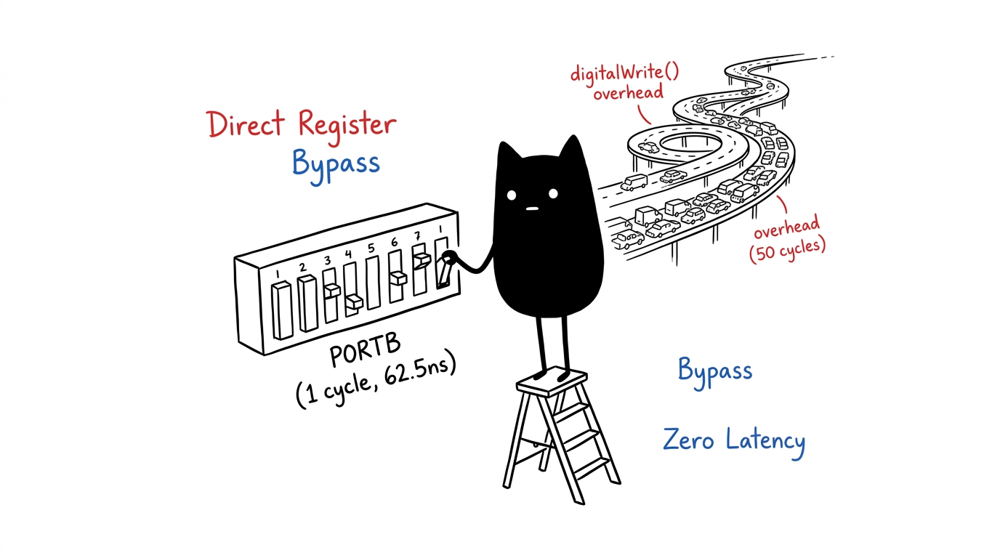
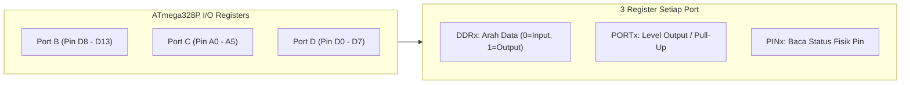

# Modul 11: Direct Port Manipulation & Register I/O

Memahami arsitektur register internal chip ATmega328P untuk mengontrol pin input/output dengan efisiensi tingkat silikon, bypass overhead fungsi Arduino Core, dan mempercepat eksekusi hingga 50 kali lipat.

---

## 1. Mengapa Perlu Direct Port Manipulation?

Saat kamu memanggil fungsi bawaan `digitalWrite(13, HIGH)`, Arduino IDE tidak langsung menyalakan pin secara instan. Di balik layar, mikrokontroler melakukan beberapa pengecekan beruntun:
1. Membaca tabel lookup pemetaan pin di memori flash (`digitalPinToPort`).
2. Mengecek apakah pin tersebut sedang menjalankan fungsi timer PWM (jika ya, fungsi `turnOffPWM()` dipanggil).
3. Mengambil alamat pointer register port I/O.
4. Menonaktifkan interupsi global sesaat (`cli()`) untuk operasi atomik, lalu mengaktifkannya kembali (`sei()`).

Rangkaian instruksi tersebut menghabiskan sekitar **40 hingga 50 siklus clock CPU** (setara dengan $\approx 3.125\ \mu\text{s}$ pada frekuensi 16 MHz).

Sebaliknya, dengan mengakses register port secara langsung via instruksi assembly AVR `sbi` (*Set Bit in I/O Register*) atau manipulasi bitwise C/C++, operasi hanya memerlukan **1 siklus clock** ($62.5\ \text{ns}$).



---

## 2. Struktur Register Port pada ATmega328P

Pin I/O pada Uno R3 dikelompokkan ke dalam tiga port 8-bit:



### Penjelasan 3 Register Kunci:
1. **`DDRx` (Data Direction Register)**  
   Menentukan apakah pin bertindak sebagai input atau output.
   * `0`: Pin dikonfigurasi sebagai **INPUT**.
   * `1`: Pin dikonfigurasi sebagai **OUTPUT**.
2. **`PORTx` (Data Register)**  
   * Jika pin adalah *OUTPUT*: Menulis `1` menghasilkan tegangan 5V (`HIGH`), menulis `0` menghasilkan 0V (`LOW`).
   * Jika pin adalah *INPUT*: Menulis `1` akan mengaktifkan resistor internal **PULL-UP**.
3. **`PINx` (Input Pins Address Register)**  
   Register *read-only* untuk membaca status logika listrik fisik pada pin saat ini.  
   *(Khusus pada AVR modern: menulis angka `1` ke register `PINx` akan membalik/toggle status logika pin secara otomatis pada level hardware tanpa perlu membaca status sebelumnya!)*.

---

## 3. Pemetaan Pin Arduino ke Bit Register

| Pin Board Uno | Nama Register AVR | Bit Posisi | Keterangan |
|---|---|---|---|
| **D0 - D7** | `PORTD` / `DDRD` / `PIND` | Bit 0 s.d 7 | Pin D0 (PD0) dan D1 (PD1) adalah RX/TX serial |
| **D8 - D13** | `PORTB` / `DDRB` / `PINB` | Bit 0 s.d 5 | Pin D13 berada di `PB5` (bit ke-5) |
| **A0 - A5** | `PORTC` / `DDRC` / `PINC` | Bit 0 s.d 5 | Pin A0 berada di `PC0`, A4/A5 adalah SDA/SCL |

---

## 4. Operasi Bitwise Wajib Dipahami

Untuk mengubah satu pin tanpa merusak atau mengubah konfigurasi pin lain di port yang sama, selalu gunakan operasi bitwise:

### A. Mengaktifkan Bit (Set to 1) dengan Operator OR (`|=`)
```cpp
// Set pin D13 (PB5) sebagai OUTPUT:
DDRB |= (1 << PB5); 

// Nyalakan pin D13 (HIGH):
PORTB |= (1 << PB5);
```

### B. Mematikan Bit (Clear to 0) dengan Operator AND-NOT (`&= ~`)
```cpp
// Set pin D8 (PB0) sebagai INPUT:
DDRB &= ~(1 << PB0);

// Matikan pin D13 (LOW):
PORTB &= ~(1 << PB5);
```

### C. Membaca Status Bit dengan Masking AND (`&`)
```cpp
// Cek apakah pin D8 (PB0) bernilai LOW (tombol ditekan):
if (!(PINB & (1 << PB0))) {
    // Tombol aktif!
}
```

---

## 5. Praktik: Benchmark Kecepatan

Buka sketch pada folder [`code/direct_port_benchmark/direct_port_benchmark.ino`](code/direct_port_benchmark/direct_port_benchmark.ino).

### Rangkaian:
* **Tombol**: Pin D8 (`PB0`) ke salah satu kaki tombol, kaki lainnya ke **GND**.
* **LED Indikator**: Menggunakan built-in LED pada pin D13 (`PB5`).

### Hasil Eksekusi di Serial Monitor (115200 baud):
```text
=== BENCHMARK PORT MANIPULATION VS DIGITALWRITE ===
Hardware: ATmega328P @ 16 MHz
Jumlah Pengujian: 50000 iterasi switching pin D13 (PB5)

Waktu digitalWrite() : 332840 mikrodetik
Waktu Direct Register: 6256 mikrodetik
Kecepatan Register   : 53.20x LEBIH CEPAT!

=== Mode Operasi Interaktif Register ===
Tekan Tombol di Pin D8 (PB0) untuk toggle LED D13 (PB5)
```

Direct register manipulation memotong waktu eksekusi dari $\approx 3.3\ \mu\text{s}$ menjadi $\approx 62.5\ \text{ns}$ per instruksi. Teknik ini diperlukan untuk menangani protokol komunikasi berkecepatan tinggi (seperti bit-banging bus) atau pembangkitan sinyal pulsa presisi.

