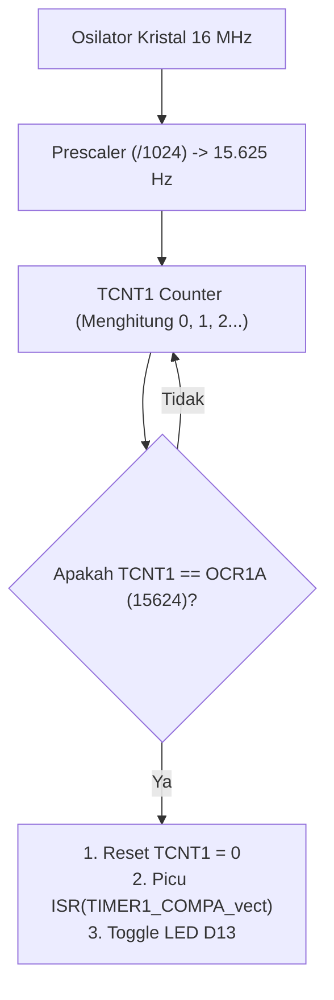

# Modul 12: Timer Interrupts & Hardware Timers

Menguasai peripheral hardware timer internal pada chip ATmega328P untuk menghasilkan eksekusi tugas periodik dengan presisi kristal mikrodetik tanpa dipengaruhi keterlambatan (*jitter*) fungsi `loop()`.

---

## 1. Mengapa Butuh Timer Interrupt Hardware?

Fungsi `millis()` atau `micros()` berbasis software polling sangat praktis, namun memiliki keterbatasan mendasar:
1. **Jitter Waktu**: Jika fungsi di dalam `loop()` membutuhkan waktu komputasi yang panjang (misalnya menggambar ke LCD atau memproses input serial), pengecekan `if (millis() - prev >= interval)` akan terlambat dieksekusi.
2. **Ketergantungan Aliran Program**: Waktu eksekusi bergantung pada seberapa cepat prosesor menyelesaikan siklus `loop()`.

Dengan **Hardware Timer Interrupt**, timer berjalan sendiri pada level silikon transistor terpisah. Ketika nilai hitungan mencapai target, perangkat keras CPU seketika menghentikan program utama untuk mengeksekusi fungsi interupsi (**ISR**), lalu kembali melanjutkan program utama seolah tidak terjadi apa-apa.

---

## 2. Tiga Hardware Timer pada ATmega328P

| Timer | Ukuran Counter | Batas Maksimum Hitungan | Kegunaan Default di Arduino |
|---|---|---|---|
| **Timer 0** | 8-bit | $2^8 - 1 = 255$ | Digunakan fungsi `millis()`, `micros()`, dan PWM pin 5 & 6 |
| **Timer 1** | 16-bit | $2^{16} - 1 = 65.535$ | Mengendalikan PWM pin 9 & 10, library servo, dan pewaktu presisi tinggi |
| **Timer 2** | 8-bit | $2^8 - 1 = 255$ | Mengendalikan fungsi `tone()` dan PWM pin 3 & 11 |

> **Peringatan**: Jangan mengubah konfigurasi **Timer 0** jika proyek kamu masih mengandalkan fungsi `delay()` atau `millis()`, karena fungsi tersebut akan rusak jika Timer 0 dimodifikasi. Gunakan **Timer 1** (16-bit) untuk aplikasi pewaktu kustom presisi tinggi.

---

## 3. Cara Kerja Mode CTC (Clear Timer on Compare Match)

Pada mode normal, counter timer menghitung dari 0 hingga kapasitas maksimum (65.535 pada Timer 1), lalu meluap (*overflow*) kembali ke 0.

Pada mode **CTC**, kita menentukan angka batas atas pada register `OCR1A`. Counter menghitung dari 0 hingga mencapai nilai `OCR1A`, memicu interupsi, dan seketika mereset counter kembali ke 0 secara otomatis.

---

## 4. Rumus Perhitungan Nilai Register OCR1A

Untuk menghitung nilai register perbandingan `OCR1A`:

$$\text{OCR1A} = \left( \frac{f_{\text{CPU}}}{\text{Prescaler} \times f_{\text{target}}} \right) - 1$$

* $f_{\text{CPU}} = 16.000.000\text{ Hz}$ (Kristal Uno R3)
* $f_{\text{target}} = 1\text{ Hz}$ (Interval tepat 1 detik)
* Pilihan Prescaler Timer 1: 1, 8, 64, 256, atau 1024.

Jika kita memilih Prescaler **1024**:
$$\text{OCR1A} = \left( \frac{16.000.000}{1024 \times 1} \right) - 1 = 15.625 - 1 = 15.624$$

Karena angka $15.624 \le 65.535$ (muat dalam register 16-bit), prescaler 1024 adalah konfigurasi yang tepat.

---

## 5. Register Kontrol Timer 1

1. **`TCCR1A` & `TCCR1B` (Timer/Counter Control Register 1 A & B)**  
   * Mengatur mode operasi (CTC diaktifkan via bit `WGM12` di `TCCR1B`).
   * Mengatur prescaler via bit `CS12`, `CS11`, `CS10`.
2. **`OCR1A` (Output Compare Register 1 A)**  
   Menyimpan angka target pembanding (15624 untuk 1 detik).
3. **`TIMSK1` (Timer Interrupt Mask Register 1)**  
   Mengaktifkan interupsi perbandingan via bit `OCIE1A`.

---

## 6. Praktik Kode: Clock Presisi 1 Detik

Buka sketch pada folder [`code/timer1_precision_clock/timer1_precision_clock.ino`](code/timer1_precision_clock/timer1_precision_clock.ino).

### Aturan Emas Menulis ISR:
1. **Sangat Singkat**: Jangan pernah memanggil `delay()`, `Serial.print()` panjang, atau operasi lambat di dalam ISR.
2. **Keyword `volatile`**: Semua variabel global yang diubah di dalam ISR wajib dideklarasikan dengan `volatile`.
3. **Operasi Atomik**: Di program utama `loop()`, saat membaca variabel multi-byte (seperti `uint32_t`) yang terus diperbarui oleh ISR, nonaktifkan interupsi sesaat menggunakan `noInterrupts()` dan aktifkan kembali dengan `interrupts()` untuk mencegah nilai terpotong di tengah pembacaan.
