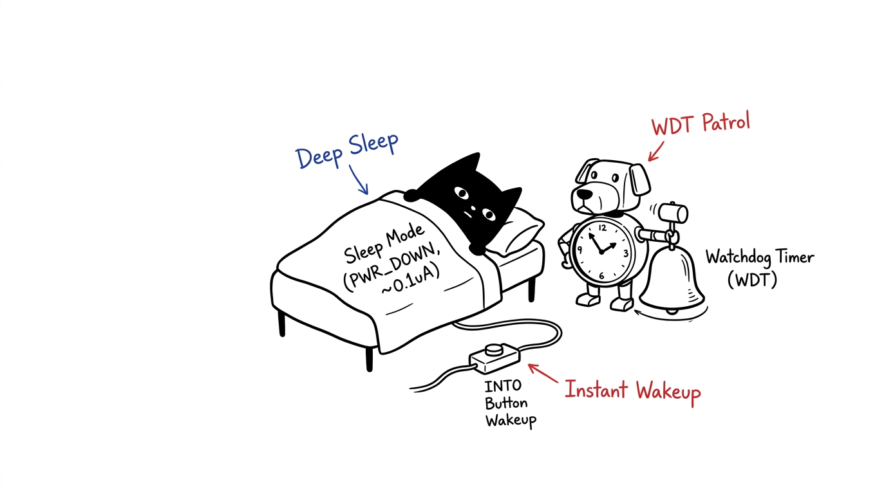
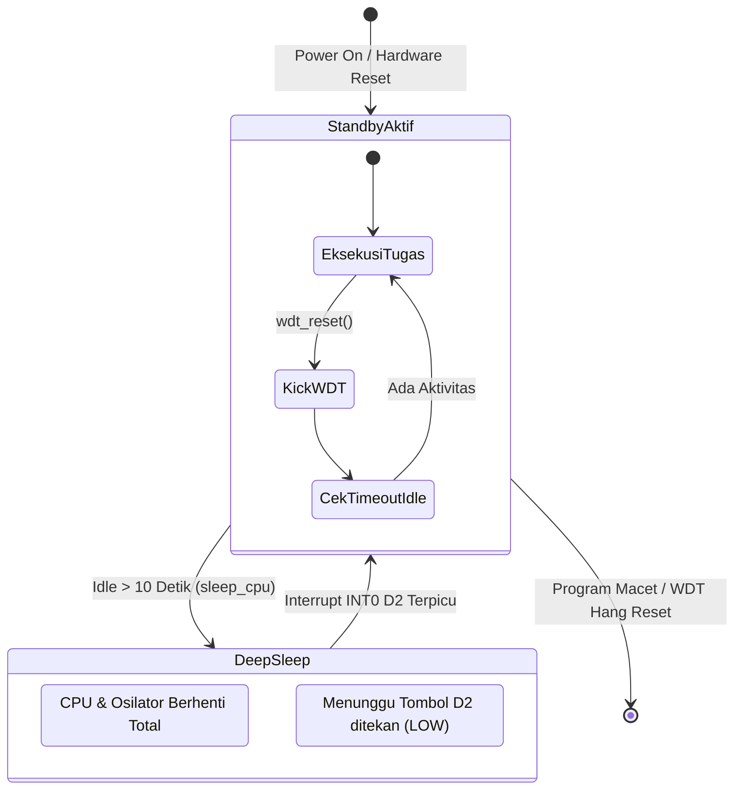

# Modul 13: Low Power Mode & Hardware Watchdog Timer

Merancang sistem embedded yang hemat konsumsi daya dan memiliki keandalan tingkat industri (*fault-tolerant*) menggunakan mode tidur mikrokontroler serta penjaga otomatis Hardware Watchdog Timer (WDT).

---

## 1. Menjaga Keandalan dengan Watchdog Timer (WDT)

Dalam operasional nyata, mikrokontroler dapat mengalami *hang* atau macet total akibat:
* Lonjakan induktif elektromagnetik (EMI) saat relay menyala/padam.
* *Infinite loop* atau *deadlock* di dalam kode perangkat lunak.
* Kerusakan pointer memori yang melompat ke alamat acak.

**Watchdog Timer (WDT)** adalah sirkuit pewaktu independen di dalam ATmega328P yang memiliki osilator internal $128\text{ kHz}$ terpisah dari clock utama. Prinsip kerjanya sederhana:
1. WDT menghitung mundur waktu (misal: 2 detik).
2. Program utama berkewajiban "memberi makan anjing penjaga" secara rutin dengan memanggil `wdt_reset()`.
3. Jika program macet dan gagal mereset WDT sebelum batas waktu habis, WDT berasumsi sistem telah mengalami kegagalan fatal dan langsung melakukan **Hardware Reset** pada mikrokontroler.

---

## 2. Mode Tidur (Sleep Modes) pada ATmega328P

Saat proyek bertenaga baterai sedang tidak melakukan pekerjaan apa pun, membiarkan mikrokontroler tetap berjalan pada kecepatan 16 MHz adalah pemborosan energi yang besar. 

Pustaka `<avr/sleep.h>` menyediakan lima tingkat penghematan daya:

| Mode Tidur | Osilator Utama | Timer Internal | Konsumsi Daya Chip | Pemicu Bangun (*Wake Source*) |
|---|---|---|---|---|
| **Idle** | Menyala | Menyala | Sedang ($\approx 15\text{ mA}$) | Semua interupsi, timer, USART, ADC |
| **ADC Noise Reduction** | Padam | Timer 2 saja | Rendah ($\approx 5\text{ mA}$) | Selesai konversi ADC, interupsi |
| **Power-save** | Padam | Timer 2 saja | Sangat Rendah | Timer 2 RTC, interupsi eksternal |
| **Power-down** | **Padam Total** | **Padam Total** | **Ultra Rendah ($< 1\ \mu\text{A}$ pada chip)** | **Interupsi Eksternal INT0/INT1 (Pin D2/D3)** |

> 📌 **Catatan Hardware**: Pada board Arduino Uno R3 lengkap, terdapat chip USB interface (CH340/16U2), regulator linier 5V, dan LED indikator ON yang tetap mengonsumsi daya sekitar $10 - 25\text{ mA}$ meskipun chip ATmega328P sudah tertidur. Namun pada rangkaian mandiri (*bare-metal board/stand-alone*), konsumsi baterai dapat ditekan hingga di bawah $1\ \mu\text{A}$.

---

## 3. Alur Siklus Hidup: Active, Sleep, dan WDT

---

## 4. Konstanta Waktu Watchdog AVR (`<avr/wdt.h>`)

WDT dapat dikonfigurasi menggunakan fungsi `wdt_enable(timeout)` dengan pilihan nilai:
* `WDTO_15MS` (15 milidetik)
* `WDTO_250MS` (250 milidetik)
* `WDTO_1S` (1 detik)
* `WDTO_2S` (2 detik — nilai rekomendasi umum)
* `WDTO_4S` (4 detik)
* `WDTO_8S` (8 detik)

---

## 5. Praktik: Smart Low-Power Controller

Buka sketch pada folder [`code/power_saving_wdt/power_saving_wdt.ino`](code/power_saving_wdt/power_saving_wdt.ino).

### Cara Menguji:
1. Hubungkan salah satu Push Button ke pin **D2** dan **GND**.
2. Hubungkan pin kendali **Relay** ke pin **D7**.
3. Buka Serial Monitor (115200 baud).
4. Amati log: jika tidak ada tombol yang ditekan selama 10 detik, sistem secara otomatis masuk ke `SLEEP_MODE_PWR_DOWN`.
5. Tekan tombol pada pin D2: mikrokontroler langsung bangun seketika, mengaktifkan relay selama 2 detik, dan mereset penghitung waktu tidur.
