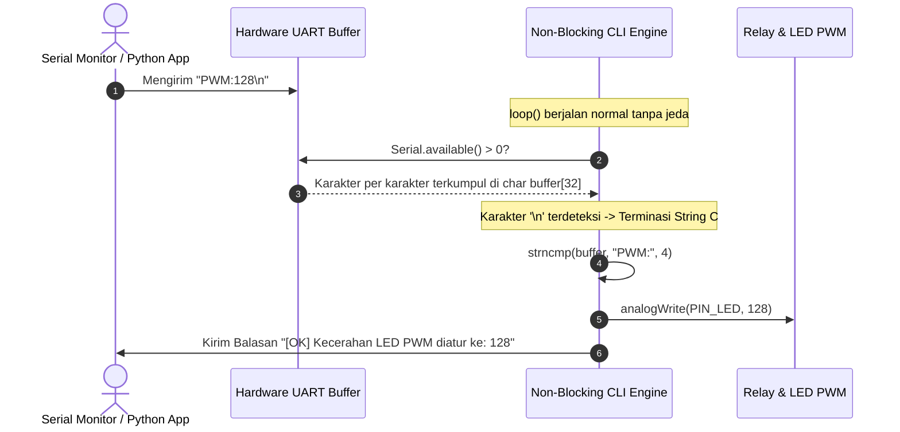

# Modul 14: Serial CLI & Non-Blocking Command Parser

Mengubah Arduino Uno R3 menjadi perangkat cerdas yang dapat dikontrol dari komputer melalui antarmuka baris perintah (*Command Line Interface* / CLI) dan mengirimkan telemetri status dalam format JSON secara asinkron tanpa *blocking*.

---

## 1. Bahaya Fungsi Serial Bawaan Arduino

Banyak pemula tergoda menggunakan fungsi bawaan seperti:
```cpp
// Berbahaya untuk sistem real-time (blocking & alokasi heap):
String input = Serial.readStringUntil('\n');
int nilai = Serial.parseInt();
```

Mengapa fungsi di atas dilarang dalam sistem embedded andal?
1. **Timeout Blocking 1.000 ms**: Jika data serial belum lengkap, fungsi akan menghentikan seluruh CPU selama 1 detik penuh menunggu karakter berikutnya. Tombol dan pembacaan sensor akan macet total.
2. **Fragmentasi RAM**: Objek `String` melakukan alokasi memori dinamis di heap yang cepat menyebabkan kehabisan RAM pada mikrokontroler 2 KB.

---

## 2. Arsitektur Parser Baris Asinkron

Solusi standar industri adalah menggunakan **Buffer Karakter Statis (`char buf[32]`)** yang diisi secara bertahap setiap kali ada karakter masuk di port UART.



---

## 3. Fungsi String C Standar yang Hemat Memori

Alih-alih pustaka string yang berat, gunakan fungsi bawaan `<string.h>`:
* **`strcmp(str1, str2)`**: Membandingkan kesamaan dua string teks. Mengembalikan `0` jika keduanya sama persis.
* **`strncmp(str1, str2, n)`**: Membandingkan kecocokan $n$ karakter pertama (sangat ideal untuk perintah berawalan parameter seperti `PWM:`).
* **`atoi(str)`**: Mengubah representasi teks angka (*ASCII to Integer*) menjadi bilangan bulat integer secara efisien.

---

## 4. Format Telemetri Mesin-ke-Mesin (M2M)

Selain membalas teks yang mudah dibaca manusia, CLI ini menyediakan perintah `STATUS` yang menghasilkan satu baris data berformat JSON:
```json
{"status":"ok","uptime":142,"relay":0,"pwm":128}
```
Format ini memungkinkan Arduino dihubungkan langsung ke antarmuka web, dashboard Node-RED, skrip Python, atau sistem otomasi Home Assistant tanpa perlu parser rumit di sisi penerima.

---

## 5. Praktik: Kontrol Penuh via Serial Monitor

Buka sketch pada folder [`code/serial_cli_controller/serial_cli_controller.ino`](code/serial_cli_controller/serial_cli_controller.ino).

### Rangkaian:
* **LED**: Hubungkan kaki anoda LED (+ Resistor $220\Omega$) ke pin **D6** (pin PWM).
* **Relay**: Hubungkan pin input sinyal relay ke pin **D7**.
* Kabel USB terhubung ke komputer.

### Pengujian:
1. Buka **Serial Monitor** di Arduino IDE.
2. Atur baud rate ke **`115200`** dan ubah opsi akhir baris menjadi **`Newline`** atau **`Both NL & CR`**.
3. Ketik `HELP` lalu tekan Enter.
4. Ketik `PWM:200` untuk mengatur kecerahan LED.
5. Ketik `RELAY:ON` dan dengarkan bunyi *klik* mekanik modul relay.
6. Ketik `STATUS` untuk mengambil status operasional saat ini.

### Simulasi Interaktif Wokwi:
* **Tautan Proyek Simulasi**: [Simulasi Wokwi - Modul 14: Serial CLI Controller](https://wokwi.com/projects/475527756542905345)
* File diagram sirkuit dan kode program tersedia di direktori [code/serial_cli_controller/](code/serial_cli_controller/).

