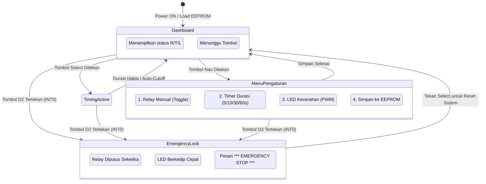

# Modul 15: Sistem Menu LCD & Capstone Otomasi Industri

Mengintegrasikan seluruh 5 komponen hardware ke dalam satu proyek utuh: Stasiun Pengendali Industri Cerdas (*Smart Industrial Controller*) dengan antarmuka menu LCD 1602, timer digital, penyimpanan EEPROM, proteksi Watchdog, dan pemutus darurat hardware (*Emergency Stop*).

---

## 1. Ikhtisar Arsitektur Capstone

Proyek ini mendemonstrasikan bagaimana seluruh modul sebelumnya disatukan menjadi produk embedded yang siap pakai:
* **LCD 1602 I2C**: Menampilkan dashboard status, countdown timer real-time, dan menu konfigurasi 4 opsi.
* **Tombol Navigasi (Pin D8)**: Berpindah antar item menu (*Next*).
* **Tombol Seleksi (Pin D9)**: Memilih opsi konfigurasi atau memulai siklus timer relay.
* **Tombol E-STOP (Pin D2 / INT0)**: Tombol darurat berbasis hardware interrupt untuk mematikan relay dalam hitungan nanodetik dan mengunci sistem.
* **Modul Relay 5V (Pin D7)**: Mengendalikan beban listrik dengan proteksi auto-cutoff.
* **LED PWM (Pin D6)**: Menjadi indikator visual status kerja dan strobo peringatan saat darurat.
* **Memori EEPROM**: Mengingat konfigurasi durasi dan tingkat kecerahan LED agar tidak hilang saat listrik padam.
* **Watchdog Timer (WDT)**: Mencegah sistem macet akibat noise atau lonjakan induktif koil relay.

---

## 2. Diagram Alir State Machine Sistem



---

## 3. Tabel Sambungan Lengkap Seluruh Komponen

| Komponen | Pin Komponen | Pin Arduino Uno | Fungsi |
|---|---|---|---|
| **LCD 1602 I2C** | VCC | 5V | Catu daya layar |
| | GND | GND | Ground bersama |
| | SDA | A4 | Komunikasi data I2C |
| | SCL | A5 | Clock I2C |
| **Tombol 1 (Navigasi)** | Kaki 1 & 2 | D8 & GND | Navigasi menu (*Active-LOW*) |
| **Tombol 2 (Select)** | Kaki 1 & 2 | D9 & GND | Eksekusi / Mulai Timer |
| **Tombol 3 (E-STOP)** | Kaki 1 & 2 | D2 (INT0) & GND | Interupsi darurat |
| **Modul Relay 5V** | VCC | 5V | Daya modul relay |
| | GND | GND | Ground |
| | IN | D7 | Logika kontrol (*Active-LOW*) |
| **LED Indikator** | Anoda (+) via $220\Omega$ | D6 | Sinyal PWM analog |
| | Katoda (-) | GND | Ground |

---

## 4. Alur Kerja Pengoperasian

1. **Dashboard Utama**:
   Layar LCD menampilkan:
   ```text
   STATUS: STANDBY
   R:OFF T:10s L:128
   ```
2. **Memulai Siklus Timer**:
   Tekan **Tombol Select (D9)**. Relay langsung berbunyi *klik* (aktif), LED menyala, dan LCD menghitung mundur sisa waktu setiap detik. Saat waktu habis, relay otomatis mati dan sistem kembali ke standby.
3. **Mengatur Parameter via Menu**:
   Tekan **Tombol Navigasi (D8)**. Layar beralih ke mode `[PENGATURAN]`. Tekan Navigasi untuk menggulir opsi (Relay Manual, Timer Durasi, LED Kecerahan, Simpan EEPROM). Tekan **Select** untuk mengubah nilai atau mengeksekusi penyimpanan ke EEPROM.
4. **Uji Keselamatan E-STOP**:
   Kapan pun tombol **D2** ditekan (bahkan saat relay sedang aktif di tengah siklus timer), perangkat keras mikrokontroler langsung memotong relay ke posisi aman (*normally-open*), mengabaikan proses lain, dan membunyikan strobo peringatan visual di LED serta LCD.

### Simulasi Interaktif Wokwi:
* **Tautan Proyek Simulasi**: [Simulasi Wokwi - Modul 15: Advanced Industrial Station](https://wokwi.com/projects/475527677492851713)
* File diagram sirkuit dan kode program tersedia di direktori [code/advanced_industrial_station/](code/advanced_industrial_station/).

