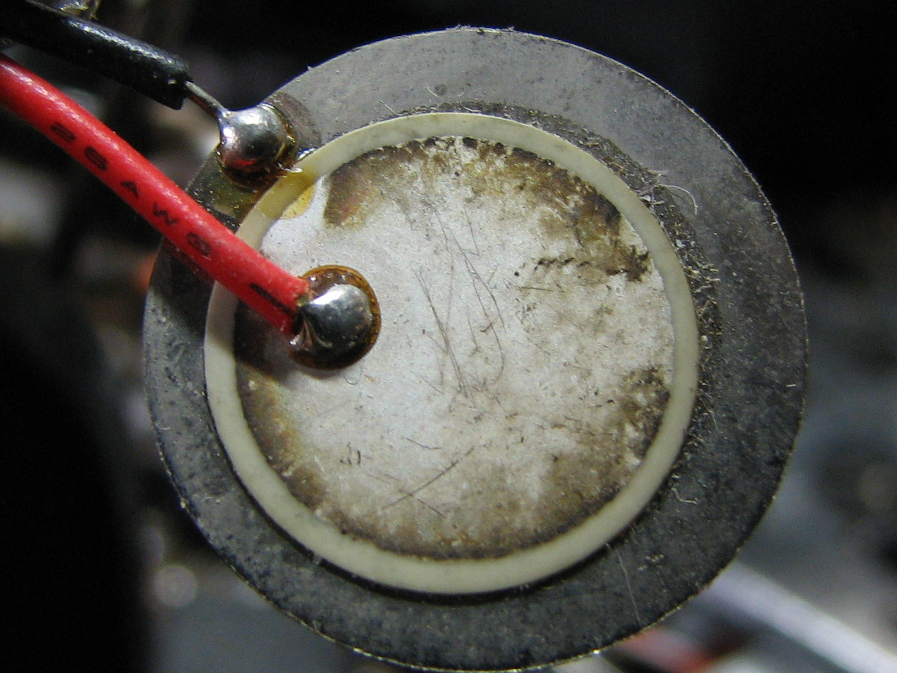
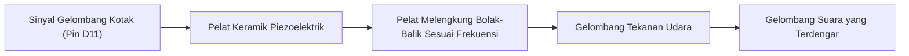

# Modul 16: Pembangkit Frekuensi & Audio dengan Buzzer

Mempelajari prinsip kerja komponen piezoelektrik, perbedaan mendasar antara buzzer aktif dan pasif, serta cara membangkitkan nada audio, melodi, dan sirine alarm secara non-blocking menggunakan fungsi hardware timer.

---

## 1. Buzzer Aktif vs Buzzer Pasif

Banyak pemula salah mengira bahwa semua buzzer bekerja dengan cara yang sama. Secara fisik keduanya sering terlihat identik, namun sirkuit internalnya bertolak belakang:



| Karakteristik | Buzzer Aktif (*Active Buzzer*) | Buzzer Pasif (*Passive Buzzer / Piezo Speaker*) |
|---|---|---|
| **Osilator Internal** | **Ada** di dalam tabung hitam | **Tidak Ada** (hanya elemen keramik piezo murni) |
| **Cara Menghidupkan** | Cukup beri tegangan DC tetap 5V (`HIGH`) | Wajib diberi sinyal frekuensi gelombang kotak AC |
| **Rentang Nada** | Hanya 1 nada tunggal bawaan pabrik ($\approx 2.3\text{ kHz}$) | Dapat membangkitkan frekuensi apa pun (31 Hz – 65 kHz) |
| **Fungsi Kode** | `digitalWrite(pin, HIGH / LOW)` | `tone(pin, frekuensi, durasi)` dan `noTone(pin)` |
| **Kegunaan** | Alarm bip sederhana atau bel pintu | Melodi musik, sirine ambulans, nada feedback UI |

> **Cara Membedakan Tanpa Alat**: Hubungkan kedua kaki buzzer langsung ke baterai kancing 3V atau pin 5V dan GND Arduino. Jika langsung berbunyi *"biiip"*, itu adalah **Buzzer Aktif**. Jika hanya mengeluarkan suara ketukan klik *"tik"* satu kali lalu hening, itu adalah **Buzzer Pasif**.

---

## 2. Cara Kerja Elemen Piezoelektrik

Buzzer pasif bekerja berdasarkan **Efek Piezoelektrik Terbalik (*Reverse Piezoelectric Effect*)**. Di dalam tabungnya terdapat piringan keramik tipis (*lead zirconate titanate* / PZT) yang dilekatkan pada pelat logam kuningan.



Ketika tegangan listrik polaritas bolak-balik dialirkan, kristal keramik memuai dan menyusut secara bergantian. Getaran mekanis ini menggetarkan diafragma logam, menciptakan gelombang tekanan udara yang kita dengar sebagai nada audio.

---

## 3. Hardware Timer di Balik Fungsi `tone()`

Fungsi `tone(pin, frekuensi, durasi)` pada Arduino Uno memanfaatkan **Hardware Timer 2**:
* Timer 2 membagi clock kristal 16 MHz untuk memicu toggle pin pada interval frekuensi yang diminta.
* Karena dikendalikan langsung oleh timer silikon independen, suara akan terus berbunyi di latar belakang tanpa menahan atau memperlambat eksekusi kode di dalam `loop()`.
* **Konflik Timer**: Menggunakan fungsi `tone()` akan menonaktifkan fungsi PWM (`analogWrite()`) pada pin **D3** dan **D11**, karena keduanya berbagi register Timer 2 yang sama.

---

## 4. Pola Non-Blocking Melody Sequencer

Kesalahan paling umum adalah memainkan melodi dengan rentetan `delay()`:
```cpp
// Pola buruk (blocking: tombol dan pembacaan sensor membeku saat melodi berbunyi)
tone(11, 440, 200);
delay(200);
tone(11, 523, 200);
delay(200);
```

Solusi standar industri adalah menggunakan **Finite State Machine Sequencer** berbasis `millis()`:
1. Simpan daftar nada dan durasinya ke dalam array konstan:
   ```cpp
   const uint16_t MELODI[] = { 262, 330, 392, 523 }; // C - E - G - C
   const uint16_t DURASI[] = { 100, 100, 100, 250 };
   ```
2. Loop utama memeriksa apakah durasi nada sebelumnya sudah tercapai.
3. Begitu waktu habis, kirim nada berikutnya ke `tone()` tanpa pernah menahan siklus CPU.

---

## 5. Praktik: Pembangkit 4 Efek Suara

Buka sketch pada folder [`code/buzzer_alarm_melody/buzzer_alarm_melody.ino`](code/buzzer_alarm_melody/buzzer_alarm_melody.ino).

### Rangkaian:
* **Buzzer Pasif**: Kaki (+) ke pin **D11** via resistor pembatas $100\ \Omega$, kaki (-) ke **GND**.
* **Tombol**: Pin **D2** ke salah satu kaki tombol, kaki lainnya ke **GND** (*Active-LOW*).
* **LED Indikator**: Anoda (+) ke pin **D6** via resistor $220\ \Omega$, katoda (-) ke **GND**.

### Pengujian:
Tekan tombol D2 secara berurutan untuk memicu 4 efek audio yang berbeda:
1. **Beep Singkat (2.4 kHz, 40 ms)**: Feedback taktil saat tombol ditekan.
2. **Jingle Sukses (4 Chime)**: Arpeggio akor mayor C4 - E4 - G4 - C5 tanda akses diterima.
3. **Peringatan Error (Low Buzz)**: Nada disonan rendah tanda akses ditolak.
4. **Sirine Darurat (Frequency Sweep)**: Frekuensi menyapu dari 600 Hz hingga 1500 Hz dengan sinkronisasi strobo LED.
