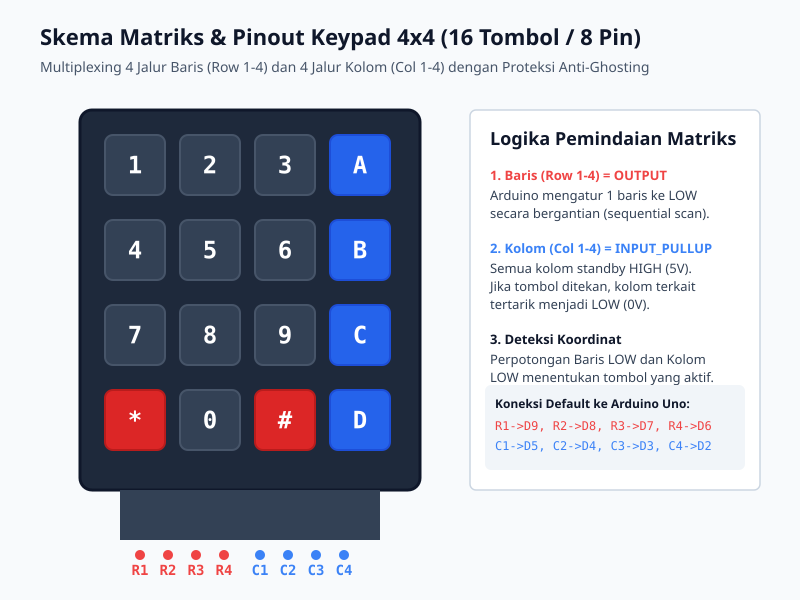
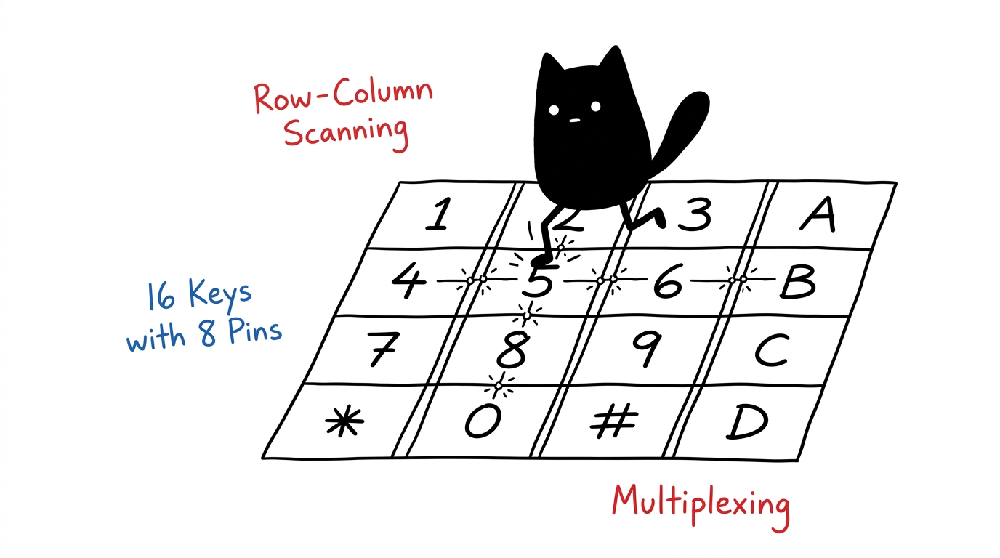
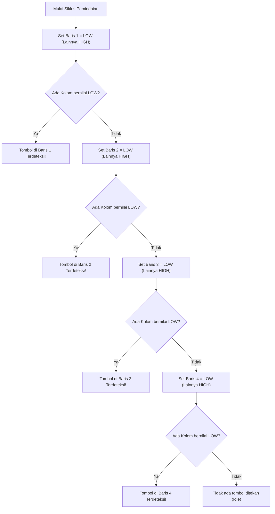

# Modul 17: Pemindaian Matriks Tombol 4x4 (Keypad Scanning)

Memahami teknik *multiplexing* matriks untuk membaca 16 tombol independen hanya dengan menggunakan 8 pin mikrokontroler, menulis algoritma pemindaian baris-kolom (*row-column scanning*) dari nol, dan mencegah kesalahan pembacaan tombol ganda (*ghosting*).

---

## 1. Masalah Keterbatasan Pin & Solusi Multiplexing

Jika kita menghubungkan 16 tombol secara konvensional, mikrokontroler membutuhkan **16 pin digital I/O terpisah**. Pada Arduino Uno R3 yang hanya memiliki total 14 pin digital, hal ini mustahil dilakukan tanpa komponen tambahan.

Dengan teknik **Matriks Baris & Kolom (*Grid Multiplexing*)**, 16 tombol disusun pada perpotongan 4 jalur baris (*Row*) dan 4 jalur kolom (*Column*):

$$\text{Jumlah Tombol} = \text{Baris} \times \text{Kolom} = 4 \times 4 = 16\text{ Tombol}$$
$$\text{Pin yang Dibutuhkan} = \text{Baris} + \text{Kolom} = 4 + 4 = 8\text{ Pin}$$

Kita menghemat 50% pin mikrokontroler.

---

## 2. Cara Kerja Pemindaian Baris-Kolom (Row-Column Scanning)

Sakelar membran di bawah tombol tidak memiliki sambungan daya listrik langsung. Sakelar tersebut hanya berfungsi sebagai jembatan yang menghubungkan satu jalur kawat baris dengan satu jalur kawat kolom saat ditekan.

### Alur Kerja Algoritma:
1. Konfigurasikan seluruh pin **Kolom (C1–C4)** sebagai `INPUT_PULLUP`. Jalur kolom berada dalam kondisi standby 5V (`HIGH`).
2. Konfigurasikan seluruh pin **Baris (R1–R4)** sebagai `OUTPUT` dengan nilai awal 5V (`HIGH`).
3. Tarik **Baris 1** ke 0V (`LOW`), sementara Baris 2, 3, dan 4 tetap 5V.
4. Baca keempat pin kolom:
   * Jika semua kolom bernilai `HIGH`, berarti tidak ada tombol di Baris 1 yang sedang ditekan.
   * Jika pin **Kolom 2** terbaca `LOW`, berarti pelat tombol menghubungkan Baris 1 dengan Kolom 2. Berdasarkan peta tombol, itu adalah angka **'2'**.
5. Kembalikan Baris 1 ke 5V (`HIGH`).
6. Ulangi langkah 3 untuk Baris 2, Baris 3, dan Baris 4 secara berurutan (*sequential sweep*).

---

## 3. Fenomena Ghosting pada Keyboard Matriks

Jika pengguna menekan tiga tombol sekaligus yang membentuk sudut persegi panjang pada matriks (misalnya tombol '1', '2', dan '4'), arus listrik dapat mengalir memutar melalui jalur ketiga tombol tersebut.

Akibatnya, mikrokontroler akan salah mendeteksi bahwa tombol keempat ('5') juga ikut tertekan, padahal jari tidak menyentuhnya. Fenomena tombol bayangan ini disebut **Ghosting**.

### Pencegahan:
* **Pada Perangkat Lunak**: Cukup batasi sistem agar hanya merespons satu tombol pertama yang stabil (*Single Key Rollover*).
* **Pada Perangkat Keras Industri**: Keyboard gaming mekanikal memasang satu dioda seri pada setiap tombol untuk memblokir arus balik (*N-Key Rollover / NKRO*).

---

## 4. Tabel Sambungan Pin Keypad ke Arduino Uno

Pita kabel pita (*ribbon cable*) keypad 4x4 memiliki 8 lubang header. Hubungkan secara berurutan ke pin digital Arduino:

| No Header Keypad | Label Fungsi | Pin Arduino Uno | Konfigurasi Pin |
|:---:|:---:|:---:|:---:|
| **1** | Baris 1 (R1) | **D9** | `OUTPUT` |
| **2** | Baris 2 (R2) | **D8** | `OUTPUT` |
| **3** | Baris 3 (R3) | **D7** | `OUTPUT` |
| **4** | Baris 4 (R4) | **D6** | `OUTPUT` |
| **5** | Kolom 1 (C1) | **D5** | `INPUT_PULLUP` |
| **6** | Kolom 2 (C2) | **D4** | `INPUT_PULLUP` |
| **7** | Kolom 3 (C3) | **D3** | `INPUT_PULLUP` |
| **8** | Kolom 4 (C4) | **D2** | `INPUT_PULLUP` |

---

## 5. Praktik: Pemindai Mandiri & Penampil LCD

Buka sketch pada folder [`code/keypad_matrix_scanner/keypad_matrix_scanner.ino`](code/keypad_matrix_scanner/keypad_matrix_scanner.ino).

### Pengujian:
1. Hubungkan 8 pin keypad ke D9–D2 sesuai tabel di atas.
2. Sambungkan modul LCD 1602 I2C ke pin **A4 (SDA)** dan **A5 (SCL)**.
3. Buka **Serial Monitor** (115200 baud).
4. Tekan tombol angka (0–9), tombol huruf (A–D), serta simbol (`*` dan `#`).
5. Amati: setiap tombol yang ditekan terdeteksi seketika pada layar LCD dan Serial Monitor dengan indikator kedip LED onboard D13 tanpa membutuhkan library eksternal.

### Simulasi Interaktif Wokwi:
* **Tautan Proyek Simulasi**: [Simulasi Wokwi - Modul 17: Keypad Matrix Scanner](https://wokwi.com/projects/475527542911249409)
* File diagram sirkuit dan kode program tersedia di direktori [code/keypad_matrix_scanner/](code/keypad_matrix_scanner/).

