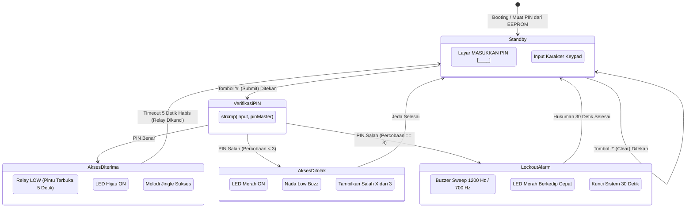

# Modul 18: Sistem Akses Keamanan PIN Keypad 4x4 & Audio Alarm

Mengintegrasikan seluruh periferal (Keypad 4x4, LCD 1602 I2C, Piezo Buzzer, Modul Relay, LED Status, dan EEPROM) ke dalam sistem keamanan pintu elektronik tingkat industri (*Electronic Keypad Access Control*).

---

## 1. Ikhtisar Arsitektur Sistem Keamanan

Proyek ini mereplikasi mekanisme kunci pintu digital dan brankas modern:
1. **Keypad 4x4**: Memasukkan 4 digit kode PIN rahasia.
2. **LCD 1602 I2C**: Menampilkan prompt interaktif dan menyamarkan angka yang diketik dengan simbol bintang (`*`).
3. **Piezo Buzzer**: Memberikan umpan balik audio: bunyi klik saat menekan tombol, nada jingle merdu saat PIN benar, dan nada disonan saat salah.
4. **Modul Relay 5V**: Menggerakkan selenoid kunci pintu (terbuka selama 5 detik saat akses disetujui).
5. **Proteksi Brute-Force (Lockout)**: Jika salah memasukkan PIN sebanyak 3 kali berturut-turut, sistem membunyikan sirine alarm darurat dan mengunci seluruh operasi selama 30 detik.
6. **Penyimpanan EEPROM**: Kode PIN tersimpan di memori non-volatile dan tidak akan ter-reset meskipun suplai daya diputus.

---

## 2. Diagram Status Sistem Keamanan (Security FSM)

---

## 3. Matriks Sambungan Seluruh Pin Hardware

| Perangkat | Label Pin Komponen | Pin Arduino Uno | Konfigurasi |
|---|---|---|---|
| **Keypad 4x4** | Pin 1 (R1) | **D9** | `OUTPUT` |
| | Pin 2 (R2) | **D8** | `OUTPUT` |
| | Pin 3 (R3) | **D7** | `OUTPUT` |
| | Pin 4 (R4) | **D6** | `OUTPUT` |
| | Pin 5 (C1) | **D5** | `INPUT_PULLUP` |
| | Pin 6 (C2) | **D4** | `INPUT_PULLUP` |
| | Pin 7 (C3) | **D3** | `INPUT_PULLUP` |
| | Pin 8 (C4) | **D2** | `INPUT_PULLUP` |
| **Buzzer Pasif** | Kaki (+) via $100\Omega$ | **D11** | Output Sinyal Frekuensi (`tone()`) |
| | Kaki (-) | **GND** | Ground |
| **Modul Relay** | Sinyal (IN) | **D12** | `OUTPUT` (*Active-LOW*, Kunci Pintu) |
| | VCC & GND | **5V & GND** | Daya Relay |
| **LED Merah** | Anoda (+) via $220\Omega$ | **D10** | Indikator Akses Ditolak / Alarm |
| | Katoda (-) | **GND** | Ground |
| **LED Hijau** | Anoda (+) via $220\Omega$ | **D13** (PB5) | Indikator Akses Diterima |
| | Katoda (-) | **GND** | Ground |
| **LCD 1602 I2C** | SDA & SCL | **A4 & A5** | Komunikasi Bus I2C |
| | VCC & GND | **5V & GND** | Catu Daya Layar |

---

## 4. Pengujian Sistem

Buka sketch pada folder [`code/keypad_security_access_controller/keypad_security_access_controller.ino`](code/keypad_security_access_controller/keypad_security_access_controller.ino).

1. **Uji Akses Berhasil**:
   * Ketik `1234` pada keypad, lalu tekan `#`.
   * Layar LCD menampilkan `AKSES DITERIMA! SILAKAN MASUK`.
   * Melodi jingle berbunyi, LED hijau menyala, dan relay berbunyi klik (kunci terbuka) selama 5 detik sebelum otomatis terkunci kembali.
2. **Uji Pembatalan Ketik**:
   * Ketik sembarang angka, lalu tekan `*` untuk menghapus dan mengulang input.
3. **Uji Perlindungan Brute-Force**:
   * Masukkan PIN yang salah sebanyak 3 kali berturut-turut.
   * Pada percobaan ketiga, sistem seketika membunyikan sirine alarm kencang dua nada bergantian, LED merah berkedip cepat (*strobo*), dan sistem terkunci total selama 30 detik.
