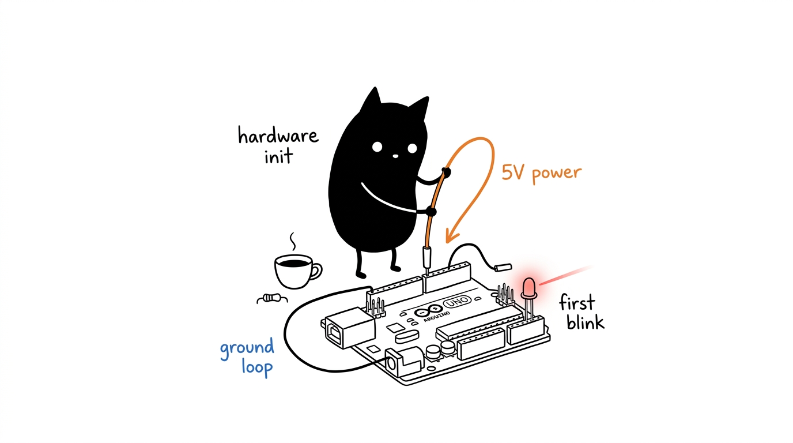

# Tutorial Arduino Lengkap: Dari Nol sampai Menengah

Panduan praktik pemrograman mikrokontroler dengan Arduino Uno R3. Materi disusun bertahap mulai dari pemahaman sirkuit board, instalasi lingkungan kerja, pemrograman C/C++, hingga pembuatan sistem otomasi berbasis Finite State Machine (FSM) dan interrupt.

Semua contoh sirkuit dan kode di tutorial ini dirancang khusus agar dapat dipraktikkan langsung menggunakan satu set komponen standar yang terjangkau.

---

## Hardware yang Digunakan

Seluruh materi dari Modul 01 sampai Modul 18 disusun menggunakan komponen standar berikut:

| Komponen | Tipe / Spesifikasi | Fungsi di Materi |
|---|---|---|
| **Arduino Uno R3** | Mikrokontroler ATmega328P (16 MHz, 5V) | Otak pemroses utama |
| **LCD 1602 + I2C** | 16 kolom x 2 baris dengan backpack PCF8574 | Menampilkan data, menu, dan status PIN |
| **Push Button** | Tactile switch 4 pin (2–3 buah) | Input tombol dan interupsi darurat |
| **Modul Relay 5V** | 1 channel dengan isolasi optocoupler | Sakelar beban listrik dan kunci solenoid |
| **LED & Resistor** | LED 5mm (Merah, Hijau, Kuning) + Resistor $220\Omega$ | Indikator visual, PWM, dan status akses |
| **Buzzer Pasif** | Transduser piezoelektrik keramik + Resistor $100\Omega$ | Umpan balik audio nada, melodi, dan sirine |
| **Keypad Matriks 4x4** | 16 tombol membran/tactile (0-9, A-D, *, #) | Input numerik sandi PIN keamanan |
| *Pendukung* | Breadboard 400/830 titik + Kabel Jumper (M-M, M-F) | Menyusun sirkuit tanpa solder |

> Daftar spesifikasi belanja komponen, kabel jumper, software IDE, driver, dan simulasi Wokwi tersedia di [**KOMPONEN.md**](KOMPONEN.md).

---

## Jalur Belajar (18 Modul)

Materi disusun terstruktur dalam 4 tingkatan. Ikuti materi secara berurutan:

### Tingkat 1: Fondasi Elektronika & Pemrograman C/C++
| Modul | Materi Pokok | Praktik yang Dibuat |
|---|---|---|
| [**Modul 01**](01_pengenalan_dan_hardware/README.md) | Sejarah Arduino, perbandingan board, dan anatomi sirkuit Uno R3 | Identifikasi komponen fisik dan batasan pin board |
| [**Modul 02**](02_arduino_ide_toolchain/README.md) | Arduino IDE 2.x, driver USB, Boards Manager, Serial Monitor, dan toolchain | Menyiapkan IDE, mendeteksi port, dan memahami proses upload |
| [**Modul 03**](03_dasar_elektronika/README.md) | Hukum Ohm, perhitungan resistor LED, cara kerja switch, dan proteksi relay | Menghitung nilai resistor dan merakit sirkuit aman |
| [**Modul 04**](04_pemrograman_embedded_cpp/README.md) | Siklus `setup()`/`loop()`, tipe data hemat memori, dan bahaya `String` | Menulis program C/C++ efisien untuk RAM 2KB |
| [**Modul 05**](05_digital_io_dan_debouncing/README.md) | Digital I/O, `INPUT_PULLUP`, contact bounce, dan software debouncing | Tombol tekan stabil untuk menyalakan LED tanpa getar mekanik |

### Tingkat 2: Kontrol Aktuator, Sinyal & Komunikasi Serial
| Modul | Materi Pokok | Praktik yang Dibuat |
|---|---|---|
| [**Modul 06**](06_pwm_dan_dimmer/README.md) | Prinsip kerja PWM, duty cycle, fungsi `analogWrite()`, dan timer | Pengatur kecerahan LED bertingkat dan efek breathing |
| [**Modul 07**](07_serial_dan_i2c_lcd1602/README.md) | Protokol UART, Serial Plotter, wiring I2C, dan library LCD 1602 | Mengirim perintah dari PC dan menampilkan karakter kustom di LCD |
| [**Modul 08**](08_kendali_relay/README.md) | Struktur modul relay 5V, optoisolator, logika Active-LOW, dan terminal NO/NC | Sakelar beban listrik aman dengan indikator status |
| [**Modul 09**](09_bus_i2c_dan_eeprom/README.md) | Scan alamat bus I2C (`Wire.h`) dan simpan status ke memori EEPROM internal | Menyimpan status sakelar agar tidak hilang saat mati lampu |
| [**Modul 10**](10_arsitektur_fsm_interrupt_capstone/README.md) | Non-blocking `millis()`, Finite State Machine, dan hardware interrupt | *Capstone*: Pengendali beban industri dengan mode timer dan tombol darurat |

### Tingkat 3: Arsitektur Tingkat Lanjut & Bare-Metal AVR
| Modul | Materi Pokok | Praktik yang Dibuat |
|---|---|---|
| [**Modul 11**](11_port_manipulation_dan_register/README.md) | Direct Port Manipulation (`DDRx`, `PORTx`, `PINx`) dan operasi bitwise AVR | Benchmark kecepatan switching I/O: 50x lebih cepat dari `digitalWrite()` |
| [**Modul 12**](12_timer_interrupt_dan_hardware_timers/README.md) | Anatomi Timer0/Timer1/Timer2 hardware, mode CTC, kalkulasi prescaler | Clock presisi kristal 1.000 Hz independen tanpa jitter `loop()` |
| [**Modul 13**](13_low_power_dan_watchdog_timer/README.md) | Mode tidur hemat energi (`SLEEP_MODE_PWR_DOWN`) dan Watchdog Timer (WDT) | Sistem fault-tolerant: auto-sleep idle, bangun via INT0, auto-reboot saat hang |
| [**Modul 14**](14_serial_cli_dan_command_parser/README.md) | Command-Line Interface (CLI) serial non-blocking dan telemetri JSON | Mengontrol relay dan dimmer via terminal teks komputer tanpa blocking |
| [**Modul 15**](15_sistem_menu_lcd_dan_capstone_lanjutan/README.md) | Sistem menu LCD navigasi 2 tombol, EEPROM state, dan E-STOP interrupt | *Advanced Capstone*: Stasiun kendali otomasi industri cerdas terintegrasi |

### Tingkat 4: Periferal Matriks & Sistem Keamanan Terpadu
| Modul | Materi Pokok | Praktik yang Dibuat |
|---|---|---|
| [**Modul 16**](16_pembangkit_frekuensi_dan_buzzer/README.md) | Fisika keramik piezo, buzzer aktif vs pasif, register Timer 2 `tone()` | Pembangkit audio efek non-blocking: beep klik, jingle sukses, sirine sweep |
| [**Modul 17**](17_keypad_matriks_4x4_scanning/README.md) | Grid multiplexing 16 tombol dengan 8 pin, algoritma row-column sweep | Scanner keypad mandiri tanpa library eksternal dengan feedback LCD I2C |
| [**Modul 18**](18_sistem_keamanan_keypad_pin_access/README.md) | Integrasi 7 periferal: Keypad 4x4, LCD, Buzzer, Relay, LED, EEPROM | *Grand Capstone*: Sistem kontrol akses kunci pintu PIN dengan proteksi lockout |

## Dokumen Pendukung & Referensi Cepat

* [**KOMPONEN.md**](KOMPONEN.md) — Daftar lengkap kebutuhan hardware (Uno R3, relay, LCD, tombol, LED), software IDE, driver, dan simulator Wokwi.
* [**GLOSARIUM.md**](GLOSARIUM.md) — Kamus istilah A–Z elektronika, arsitektur chip AVR, dan embedded C++.
* [**ERRORS.md**](ERRORS.md) — Panduan pemecahan masalah: error kompilasi, port serial Linux, avrdude, dan bug hardware.
* [**CHEATSHEET.md**](CHEATSHEET.md) — Lembar sontekan satu halaman: pinout Uno R3, batas elektrik, register bitwise, dan rumus.

---

## Lisensi

Seluruh materi dan contoh kode bebas digunakan, dipelajari, dan dibagikan kembali di bawah lisensi [**MIT License**](LICENSE).

