# Seri Tutorial Lengkap Arduino: Dari Pemula hingga Menengah

Selamat datang di repositori resmi seri panduan dan tutorial komprehensif pemrograman mikrokontroler menggunakan platform **Arduino**. Tutorial ini disusun secara sistematis, berbasis praktik nyata (*hands-on*), dan dirancang bagi siapa saja—mulai dari pemula tanpa latar belakang elektronika hingga yang ingin menguasai arsitektur *embedded software* tingkat menengah.

---

## 🧰 Standar Hardware Kit (Bill of Materials)

Seluruh modul dalam seri ini dirancang agar dapat direplikasi **hanya menggunakan 5 komponen inti** tanpa memerlukan sensor rumit atau shield mahal:

| No | Komponen | Spesifikasi / Catatan | Peran dalam Modul |
|---|---|---|---|
| 1 | **Arduino Uno R3** | Mikrokontroler ATmega328P (DIP/SMD), 16 MHz, 5V | Otak pengendali utama |
| 2 | **LCD 1602 + Modul I2C** | 16 Kolom $\times$ 2 Baris, backpack PCF8574 (SDA/SCL) | Display visual data & antarmuka menu |
| 3 | **Push Button** | Tactile switch 6x6mm (2-3 buah) | Input digital, navigasi, dan interrupt |
| 4 | **Modul Relay 5V** | 1 atau 2 Channel dengan Optocoupler Isolator | Pengendali beban daya tinggi (AC/DC) |
| 5 | **LED & Resistor** | LED 5mm (Merah, Hijau, Kuning) + Resistor $220\Omega / 330\Omega$ | Indikator status & eksperimen PWM |
| 6 | *Aksesori Tambahan* | Breadboard 830/400 titik, Kabel Jumper (M-M & M-F) | Perakitan sirkuit bebas solder |

> [!TIP]
> Semua modul dapat disimulasikan secara virtual tanpa hardware fisik melalui platform [Wokwi Arduino Simulator](https://wokwi.com/).

---

## 🗺️ Peta Kurikulum (10 Modul Terstruktur)

```mermaid
flowchart LR
    subgraph S1["Fase 1: Fondasi"]
        M01["01. Hardware & Ekosistem"]
        M02["02. Arduino IDE 2.x"]
        M03["03. Dasar Elektronika"]
        M04["04. Embedded C/C++"]
    end

    subgraph S2["Fase 2: I/O & Sinyal"]
        M05["05. Digital I/O & Debounce"]
        M06["06. PWM & Dimmer LED"]
        M07["07. Serial & I2C LCD"]
    end

    subgraph S3["Fase 3: Aktuator & Bus"]
        M08["08. Kendali Modul Relay"]
        M09["09. Bus I2C & EEPROM"]
    end

    subgraph S4["Fase 4: Arsitektur Menengah"]
        M10["10. Non-Blocking, FSM & Capstone"]
    end

    S1 --> S2 --> S3 --> S4
```

| Modul | Topik Bahasan | Target Kompetensi |
|---|---|---|
| [**Modul 01**](01_pengenalan_dan_hardware/README.md) | **Pengenalan Arduino, Sejarah & Anatomi Uno R3** | Memahami sejarah, arsitektur AVR, komparasi board, dan anatomi sirkuit Uno R3. |
| [**Modul 02**](02_arduino_ide_toolchain/README.md) | **Kupas Tuntas Arduino IDE 2.x, Toolchain & Driver** | Instalasi IDE, manajemen board/library, Serial tools, dan siklus kompilasi toolchain. |
| [**Modul 03**](03_dasar_elektronika/README.md) | **Dasar Elektronika untuk Mikrokontroler** | Hukum Ohm, voltage divider, komponen pasif/aktif, dan batas toleransi pin MCU. |
| [**Modul 04**](04_pemrograman_embedded_cpp/README.md) | **Fondasi Pemrograman Embedded C/C++** | Struktur program, efisiensi tipe data, eliminasi objek `String`, pointer, dan fungsi. |
| [**Modul 05**](05_digital_io_dan_debouncing/README.md) | **Digital Input/Output, Sakelar & Debouncing** | `pinMode()`, `INPUT_PULLUP`, fenomena bouncing, dan software debouncing `millis()`. |
| [**Modul 06**](06_pwm_dan_dimmer/README.md) | **Pulse Width Modulation (PWM) & Dimmer LED** | Teori duty cycle, pin timer PWM, `analogWrite()`, efek breathing, dan tangga kecerahan. |
| [**Modul 07**](07_serial_dan_i2c_lcd1602/README.md) | **Komunikasi Serial UART & Display I2C LCD 1602** | UART framing 8N1, Serial Plotter, backpack I2C PCF8574, dan custom character glyph. |
| [**Modul 08**](08_kendali_relay/README.md) | **Kendali Beban Tinggi dengan Modul Relay 5V** | Koil induktif, optocoupler isolator, logika Active-LOW, dan proteksi beban listrik. |
| [**Modul 09**](09_bus_i2c_dan_eeprom/README.md) | **Protokol Bus I2C & Memori Non-Volatile (EEPROM)** | Addressing SDA/SCL, scanner alamat I2C, dan persistensi status relay pada EEPROM internal. |
| [**Modul 10**](10_arsitektur_fsm_interrupt_capstone/README.md) | **Arsitektur Embedded Menengah & Capstone Project** | Arsitektur non-blocking `millis()`, Finite State Machine (FSM), external interrupt ISR, dan proyek akhir *Smart Industrial Controller*. |

---

## 🚀 Cara Menggunakan Repositori Ini

1. **Urutan Belajar**: Disarankan membaca secara runut dari **Modul 01** agar fondasi elektronika dan konsep memori mikroarsitektur terbentuk kuat sebelum melangkah ke pemrograman non-blocking.
2. **Praktik Langsung**: Setiap modul disertai skematik rangkaian visual, penjelasan kode baris-demi-baris, dan file program `.ino` siap kompilasi.
3. **Standar Kode**: Kode mengutamakan prinsip efisiensi memori, tanpa fungsi `delay()` pada tahap lanjut, serta penamaan variabel yang deskriptif dan aman.

---

## 📜 Lisensi & Kontribusi

Dokumen dan kode di repositori ini didistribusikan di bawah lisensi **MIT License**. Terbuka untuk dijadikan bahan ajar, referensi tugas akhir, maupun dikembangkan lebih lanjut oleh komunitas pengembang embedded dan maker.
